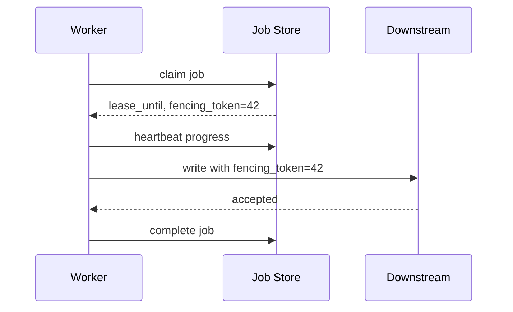
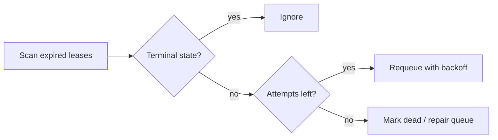

# リース、Heartbeat、復旧

> この記事は英語版から翻訳されました。最新版は[英語版](/18-workflow-job-systems/08-leases-heartbeats-recovery)をご覧ください。

ワークフロー/ジョブシステムは、誰が現在その作業を実行してよいかをリースで決めます。リースは時間制限付きのclaimであり、他のワーカーが完全に止まった証明ではありません。heartbeatは進行中であることを示しリースを延長します。リース期限切れで復旧が始まりますが、期限切れワーカーがまだ動く可能性があるため、冪等性とfencingが必要です。

## Lease vs Lock

| 仕組み | 意味 |
|---|---|
| Lock | releaseまで排他。owner死亡時に危険 |
| Lease | deadlineまで排他 |
| Heartbeat | ownerが生存/進捗を示しlease延長 |
| Fencing token | stale ownerをdownstreamが拒否する単調増加token |

leaseは無期限lockより復旧しやすいですが、exactly-once executionを保証しません。

## 基本フロー



後からtoken 43のワーカーが来たら、downstreamはtoken 42のstale writeを拒否します。

## Lease Duration

| 短すぎる | 長すぎる |
|---|---|
| 正常なGC pause/遅いcallで重複attempt | worker death後の復旧が遅い |
| downstream duplicate圧力増加 | stuck jobが長く見えない |
| heartbeat traffic増加 | false expiration減少 |

平均runtimeではなく、P99 heartbeat delayと余裕で決めます。

## Heartbeat Payload

```json
{
  "processed_records": 250000,
  "last_object_key": "logs/2026/06/15/part-00042.gz",
  "updated_at": "2026-06-15T10:30:00Z"
}
```

checkpoint境界を設計していれば、retry時にゼロからやり直さず再開できます。

## Recovery Controller



復旧はワーカーの副作用ではなくcontrollerにします。stuck-state policyを明示的にテストできます。

## Orphan Detection

orphanとは、terminalでもrunnableでもない作業です。

- leaseなしでstatusがrunning
- 永続化されていないtimerを待っている
- Activity完了したがcompletion eventがない
- parent cancel後もchild jobが動く

reconciliation jobで不可能状態をscanし、修復またはalertします。

## Fencing

```sql
UPDATE resources
SET value = :new_value,
    fencing_token = :token
WHERE id = :id
  AND fencing_token < :token;
```

更新行数が0ならworkerはstaleです。

## 障害モード

| 障害 | 原因 | 対策 |
|---|---|---|
| split execution | lease切れ後も旧workerが継続 | fencingと冪等副作用 |
| lost heartbeat | network blip | lease marginとheartbeat retry |
| zombie worker | processは固まるがheartbeatだけ続く | livenessでなくprogress heartbeat |
| stuck running | workerがrelease前に死亡 | expired-lease scanner |
| double completion | 2 workersがcompletion競合 | CAS terminal transition |

## 関連パターン

- [分散ロック](../01-foundations/09-distributed-locks.md)
- [Failure Modes](../01-foundations/06-failure-modes.md)
- [Leader Election](../02-distributed-databases/09-leader-election.md)
- [Delivery Guarantees](../05-messaging/04-delivery-guarantees.md)
