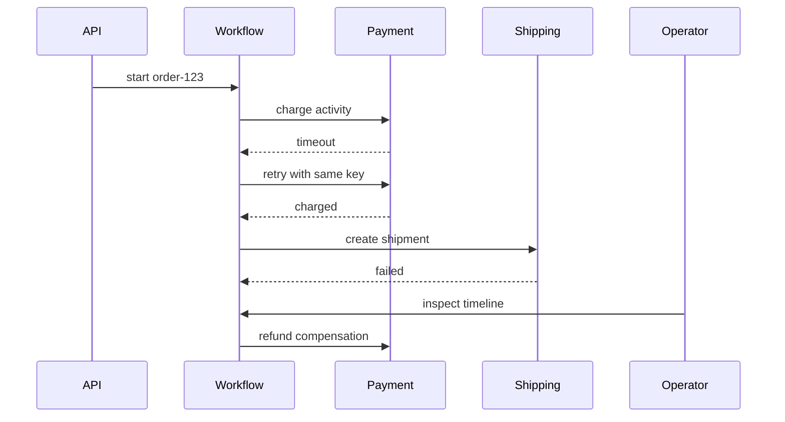

# ワークフロー観測性とリプレイ

> この記事は英語版から翻訳されました。最新版は[英語版](/18-workflow-job-systems/09-workflow-observability-replay)をご覧ください。

ワークフロー観測性は通常のサービス観測性と違う問いに答えます。サービスtraceは「このリクエストで何が起きたか」を見ます。ワークフローtraceは「この業務プロセスはどこにいて、何をすでにcommitし、なぜ待っていて、次に何を安全にできるか」を見ます。長時間実行システムでは、observability、replay、repair toolingは正しさの一部です。

## 観測レイヤー

| レイヤー | 問い |
|---|---|
| Workflow instance | このプロセスはどの状態か |
| Activity attempt | どの副作用が実行/リトライ中か |
| Queue | runnable workが待ちすぎていないか |
| Scheduler | due taskが発見されているか |
| Dependency | downstreamがretry/backpressureの原因か |
| Operator action | 誰がrepair/cancel/replayしたか |

## Timeline

運用者は5つのサービスのログを読むことなく、このビューを見られる必要があります。

## Structured Events

各eventに含めるもの:

- workflow IDとtype
- run ID
- sequence number
- event type
- activity ID
- attempt number
- idempotency key
- tenant/namespace
- correlation/trace ID
- payload referenceまたはredacted payload
- trusted clock timestamp

secretや巨大payloadを履歴に直接保存しないでください。

## Replay

| replay種別 | 目的 | リスク |
|---|---|---|
| deterministic code replay | 履歴から状態を再構築 | 非決定的コードで失敗 |
| operational replay | 失敗作業や副作用を再実行 | 冪等性が弱いと重複副作用 |

operational replayは権限管理と監査が必要です。ガードなしのreplay buttonは事故を作ります。

## Repair Tools

本番システムに必要な安全なrepair primitive:

- failed activityをretry
- optional activityをskip
- external signalを注入
- workflow cancel
- continue as new
- manual action後にcompensation completeをmark
- stuck jobをrepair queueへ移動

各操作はaudit eventを追記します。DB直接編集は最後の手段です。

## Stuck Workflowの診断

| 原因 | 証拠 |
|---|---|
| signal待ち | 最終eventがwaiting、signalなし |
| timer未発火 | timerが期限超過 |
| workersなし | queue age増加、lease取得なし |
| downstream outage | retryとdependency error |
| bad deploy | version変更後にnon-determinism/error spike |
| lost wakeup | 履歴上runnableだがqueue taskなし |

## Metrics

- workflow type別 start-to-complete duration
- stateごとの滞在時間
- oldest non-terminal workflow age
- waiting workflows by reason
- activity retry histogram
- compensation failure count
- manual repair count
- replay failure count
- queue age by task type
- scheduler lag

## Alerting

| 良いalert | 悪いalert |
|---|---|
| oldest runnable task age > SLO | queue depth > N |
| timer lag > threshold | scheduler CPU high |
| compensation failures > 0 | generic workflow failures |
| stuck in state too long | workflow not completed |
| DLQ oldest age > threshold | DLQ count > N |

内部カウンタではなくユーザー/業務影響にalertします。

## Privacy and Retention

- payload全体ではなく参照を保存
- sensitive fieldsを暗号化
- event追記前にsecretをredact
- workflow typeごとにretentionを定義
- verbose activity payloadよりaudit eventを長く保持

## 関連パターン

- [Distributed Tracing](../11-observability/01-distributed-tracing.md)
- [Logging](../11-observability/03-logging.md)
- [Incident Management and Postmortems](../11-observability/07-incident-management.md)
- [Disaster Recovery](../15-deployment/05-disaster-recovery.md)
