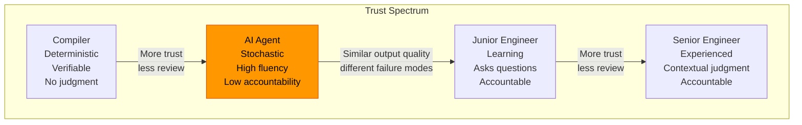
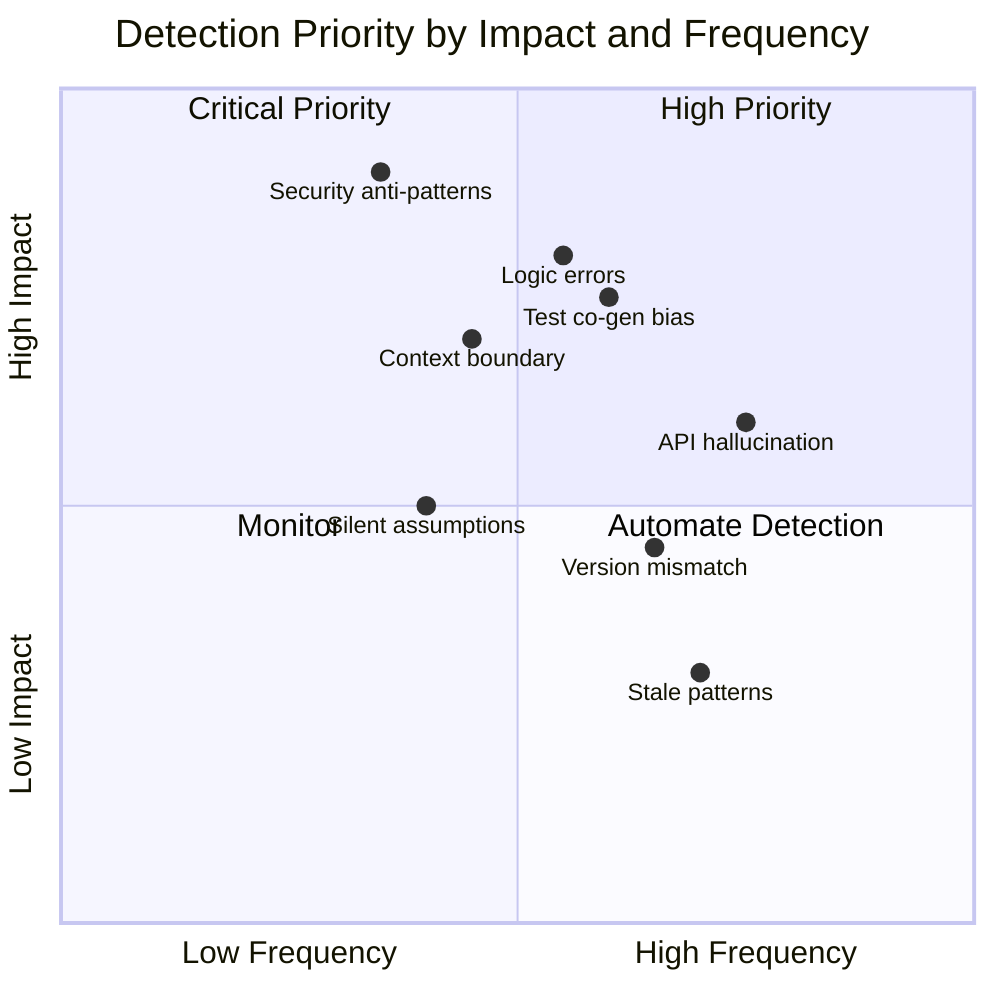
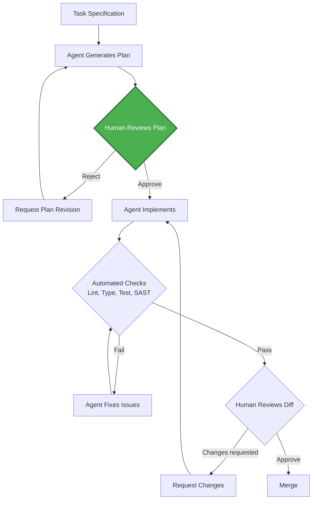
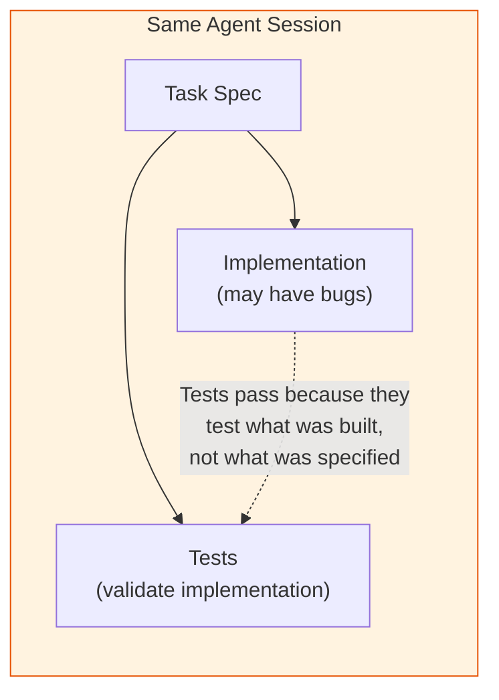
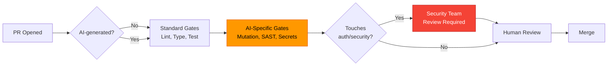
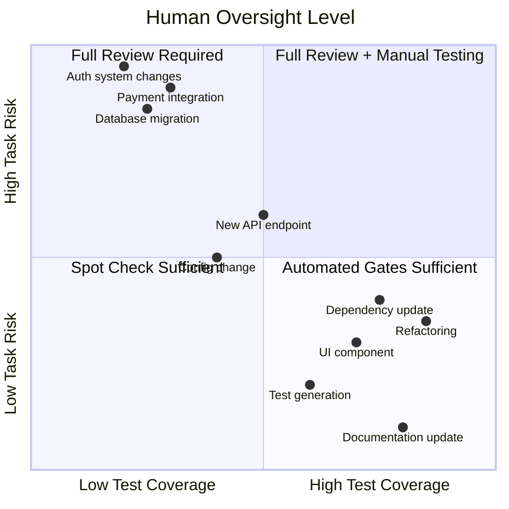

# AIエージェントによる品質エンジニアリング

> この記事は[英語版](../../19-compound-engineering/05-quality-engineering-with-ai-agents.md)から翻訳されました。

## TL;DR

AI生成コードのレビューは、人間の障害モードではなく、AIの障害モードに合わせて調整する必要があります。エージェントは**自信を持って誤ったコード**を生成し、複数ファイルにまたがる推論において**コンテキスト境界エラー**を起こし、表面的なレビューをすり抜ける**セキュリティアンチパターン**を導入し、本来発見すべき欠陥を隠してしまう**テストを共生成**します。従来のコードレビューチェックリストは必要ですが十分ではありません。AI生成コードの品質エンジニアリングには、新しい信頼モデル、専門的なレビューヒューリスティクス、およびエージェント固有の障害シグネチャに基づいて設計されたCIゲートが求められます。

---

## 信頼モデル

### エージェントが新しい信頼階層を占める理由

エージェントはジュニアエンジニアでもコンパイラでもありません。新しい信頼モデルを必要とする、独自の特性の組み合わせを示します。



### 信頼特性の比較

| 特性 | コンパイラ | AIエージェント | ジュニアエンジニア | シニアエンジニア |
|------|-----------|---------------|-------------------|-----------------|
| 決定的 | はい | いいえ | いいえ | いいえ |
| 推論を説明する | いいえ | もっともらしいが信頼性が低い | 正直だが不完全 | 正確 |
| 確認を求める | しない | まれ（仮定のまま進む） | 頻繁に | 必要な時に |
| 可視的に失敗する | 常に | まれ（静かに失敗する） | 通常は | 通常は |
| 説明責任 | 該当なし | なし | 個人 | 個人＋チーム |
| コンテキストウィンドウ | 無制限（スコープ付き） | 有限（トークン制限） | 成長中 | 深い |
| 信頼度の較正 | 完全 | 不良（過剰な自信） | 様々 | 適切に較正済み |

### 説明責任のギャップ

```
Human engineer writes buggy code → learns from review, adjusts behavior
AI agent writes buggy code      → repeats identical mistakes next session

Human engineer skips edge case  → "I didn't think of that" (honest)
AI agent skips edge case        → "Here's the comprehensive solution" (confident)
```

このギャップは、AI生成コードのレビューがジュニアエンジニアのコードレビューよりも**厳格でなければならない**ことを意味します。エージェントの出力がより洗練されて見えるにもかかわらずです。

### 較正された信頼ルール

| ルール | 根拠 |
|--------|------|
| 構造を信頼し、ロジックを検証する | エージェントはボイラープレートやスキャフォールディングに優れている |
| エラーハンドリングは決して信頼しない | エージェントはハッピーパスをパターンマッチする |
| セキュリティ境界は決して信頼しない | エージェントは防御よりも機能性を最適化する |
| 外部APIの使用はすべて検証する | 幻覚されたメソッドや誤ったシグネチャが一般的である |
| 共生成されたテストは信頼しないものとして扱う | コードと同時に書かれたテストは同じ盲点を引き継ぐ |
| 新機能よりもリファクタリングを信頼する | リファクタリングには既存のテストがセーフティネットとしてある |

---

## 障害モード分類

### 幻覚のカテゴリ

| カテゴリ | 説明 | 例 | 検出方法 | 軽減策 |
|---------|------|------|---------|--------|
| **API幻覚** | 存在しないメソッドを発明する | その実装を持たない型に対する `response.json().unwrap_or_default()` | コンパイル / 型チェック | 依存関係のバージョンを固定し、コンテキストにAPIドキュメントを提供する |
| **バージョン不一致** | 間違ったバージョンの構文やAPIを使用する | フックのみのコードベースでReactクラスコンポーネントを使用 | リンタールール、バージョン対応のSAST | システムプロンプトにフレームワークバージョンを固定する |
| **自信のあるロジックエラー** | もっともらしいが誤ったロジックを生成する | 基本テストをパスするページネーションのオフバイワン | ミューテーションテスト、プロパティベーステスト | 人間が書いたエッジケーステストケースを要求する |
| **コンテキスト境界エラー** | クロスファイルの契約を誤解する | 別モジュールから誤った引数順序で関数を呼び出す | インテグレーションテスト、コントラクトテスト | コンテキストにインターフェース定義を提供する |
| **セキュリティアンチパターン** | 機能要件を満たしながら脆弱性を導入する | 「動く」SQL文字列インターポレーション | SASTスキャナー（Semgrep [7]、CodeQL [8]） | セキュリティ重視のレビューチェックリスト |
| **陳腐化パターン** | 非推奨のアプローチを使用する | React 18での `componentWillMount` | 非推奨リンター | コンテキストを最新に保ち、移行ガイドを含める |
| **テスト共生成バイアス** | テストが仕様ではなくバグを検証する | テストが誤った出力を正しいとしてアサートする | ミューテーションテスト、仕様レビュー | テスト作成を実装から分離する |
| **暗黙の仮定** | 環境に関する文書化されていない仮定をする | UTCタイムゾーンを仮定、Linuxパスを仮定 | 環境固有のCIマトリクス | 仮定の文書化を要求する |

### 検出優先度マトリクス



### 根本原因分析

エージェントの障害のほとんどは3つの根本原因に帰着します。

```
1. TRAINING DATA BIAS
   Agent learned from Stack Overflow circa 2021
   → Uses patterns that were popular then, not now
   → Mixes conventions from different ecosystems

2. CONTEXT WINDOW LIMITS
   Agent cannot see entire codebase simultaneously
   → Makes assumptions about modules outside its view
   → Duplicates utilities that already exist elsewhere

3. OPTIMIZATION FOR PLAUSIBILITY
   Agent optimizes for "looks correct" over "is correct"
   → Produces syntactically perfect, semantically wrong code
   → Generates tests that confirm the implementation, not the spec
```

---

## 計画-実装-レビューパイプライン

### 計画承認が最もレバレッジの高いレビューゲートである理由

計画のレビューには5分かかります。誤った実装のレビューには2時間かかります [15]。計画の却下にはコストがかかりません。PRの却下にはエージェントの計算コストとレビュアーの時間がかかります。



### 計画レビューチェックリスト

| チェック | 質問 | 重要な理由 |
|---------|------|-----------|
| スコープ | 計画はタスクに一致しているか（過不足なく）？ | エージェントは過剰に装飾し、過剰設計する |
| ファイル一覧 | 変更対象のファイルは正しく完全か？ | エージェントは見せていないファイルを見落とす |
| 依存関係 | 新しい依存関係は正当化されているか？ | エージェントは些細なタスクにライブラリを追加する |
| アプローチ | アプローチはチームの慣習に合っているか？ | エージェントは最も多く学習したパターンを使用する |
| エッジケース | 障害モードは計画で対処されているか？ | エージェントはハッピーパスを計画する |
| セキュリティ | 認証/認可の境界は尊重されているか？ | エージェントはデフォルトでセキュリティを省略する |
| テスト戦略 | 計画にテストカテゴリが含まれているか？ | エージェントはデフォルトでユニットテストのみ |

### 構造化された計画フォーマット

```markdown
## Plan: [Task Title]

### Goal
One sentence describing the desired outcome.

### Files to Modify
- `src/auth/handler.ts` — Add rate limiting middleware
- `src/auth/handler.test.ts` — Add rate limit test cases

### Files to Create
- `src/middleware/rate-limit.ts` — Rate limiter implementation

### Approach
1. Step one (with rationale)
2. Step two (with rationale)

### Edge Cases
- What happens when X?
- What happens when Y?

### Out of Scope
- Things explicitly not being done

### Dependencies
- None (or list with justification)
```

### アンチパターン：計画レビューの省略

```
❌ "Just implement the feature, I trust you"
   → Agent over-engineers the solution
   → Agent modifies files outside the intended scope
   → Agent introduces a dependency for a 3-line utility
   → 2 hours of review to untangle

✅ "Write a plan first, then wait for approval"
   → 5-minute plan review catches scope creep
   → Implementation aligns with team conventions
   → Review focuses on correctness, not approach
```

---

## AIの差分を大規模にレビューする

### エージェントが正しく行うこと

| カテゴリ | 信頼性 | 必要なレビュー深度 |
|---------|--------|-------------------|
| ファイル構造とボイラープレート | 高い | 流し読み |
| 型定義とインターフェース | 高い | 流し読み |
| インポートの整理 | 高い | スキップ（リンターが処理） |
| ドキュメンテーション文字列 | 中〜高 | 正確性を確認 |
| 標準的なCRUD操作 | 中〜高 | エッジケースを確認 |
| テストのスキャフォールディング | 中程度 | アサーションを確認 |
| 設定ファイル | 中程度 | 値を確認 |

### エージェントが間違えること

| カテゴリ | 障害率 | 必要なレビュー深度 |
|---------|--------|-------------------|
| エラーハンドリングとリカバリ | 高い | 一行ずつ |
| 並行性と競合状態 | 高い | 一行ずつ |
| セキュリティ境界 | 高い | 一行ずつ＋脅威モデル |
| クロスモジュール統合 | 高い | クロスファイルレビュー |
| 負荷時のパフォーマンス | 中〜高 | ベンチマーク |
| エッジケースと境界条件 | 中〜高 | プロパティベーステストレビュー |
| リソースのクリーンアップ（接続、ファイル） | 中程度 | すべてのコードパスを確認 |
| 後方互換性 | 中程度 | すべての呼び出し元を確認 |

### PRタイプ別レビューチェックリスト

#### 新機能PR

```markdown
- [ ] Plan was reviewed and approved before implementation
- [ ] Feature flag wraps new functionality
- [ ] Error handling covers all failure modes (not just happy path)
- [ ] Input validation exists at trust boundary
- [ ] No hardcoded credentials, URLs, or environment-specific values
- [ ] Tests cover edge cases, not just golden path
- [ ] Tests were NOT generated by the same agent session (or mutation-tested)
- [ ] No unnecessary new dependencies added
- [ ] API contracts match existing conventions
- [ ] Database migrations are reversible
```

#### リファクタリングPR

```markdown
- [ ] Behavior is unchanged (verified by existing tests passing)
- [ ] No new features smuggled into the refactor
- [ ] Performance characteristics preserved
- [ ] All callers updated consistently
- [ ] No orphaned code left behind
- [ ] Import paths updated everywhere
```

#### バグ修正PR

```markdown
- [ ] Root cause identified and documented
- [ ] Fix addresses root cause, not symptom
- [ ] Regression test added BEFORE fix (proves the bug existed)
- [ ] Fix does not introduce new edge cases
- [ ] Related code paths checked for similar bugs
- [ ] Agent did not "fix" by rewriting the entire module
```

### 3パスレビュー戦略

```
Pass 1: STRUCTURAL (2 minutes)
  - Right files modified?
  - Right approach taken?
  - Any unexpected changes?
  → If structural issues found, reject immediately

Pass 2: SEMANTIC (10 minutes)
  - Logic correct for all inputs?
  - Error handling complete?
  - Security boundaries intact?
  → Focus on what agents get wrong (see table above)

Pass 3: INTEGRATION (5 minutes)
  - Does this work with the rest of the system?
  - Any contract violations?
  - Any performance implications?
  → Cross-reference with modules outside the diff
```

---

## セキュリティ監査

### エージェントが一般的に生成するCWEカテゴリ

AIエージェントは脆弱なコードを含む膨大なコードベースで訓練されています。正しいパターンと同じ流暢さでセキュリティアンチパターンを再現し、出力が危険であることを示す兆候がないことが多いです。以下のCWEカテゴリ [6] は、最も頻繁に再現されるものの一部です。

#### CWE-78: OS Command Injection [1]

```python
# ❌ Agent-generated: functional but vulnerable
import subprocess

def convert_image(filename: str, format: str) -> str:
    """Convert image to specified format."""
    output = f"{filename.rsplit('.', 1)[0]}.{format}"
    subprocess.run(f"convert {filename} {output}", shell=True)  # CWE-78
    return output

# ✅ Secure version
import subprocess
from pathlib import Path

ALLOWED_FORMATS = {"png", "jpg", "webp", "gif"}

def convert_image(filename: str, format: str) -> str:
    """Convert image to specified format."""
    if format not in ALLOWED_FORMATS:
        raise ValueError(f"Format must be one of {ALLOWED_FORMATS}")

    input_path = Path(filename)
    if not input_path.exists():
        raise FileNotFoundError(f"Input file not found: {filename}")

    output = str(input_path.with_suffix(f".{format}"))
    subprocess.run(
        ["convert", str(input_path), output],  # No shell=True, list args
        check=True,
        timeout=30,
    )
    return output
```

#### CWE-89: SQL Injection [2]

```python
# ❌ Agent-generated: works for demo, vulnerable in production
def get_user(db, username: str):
    query = f"SELECT * FROM users WHERE username = '{username}'"  # CWE-89
    return db.execute(query).fetchone()

# ✅ Secure version
def get_user(db, username: str):
    query = "SELECT * FROM users WHERE username = ?"
    return db.execute(query, (username,)).fetchone()
```

#### CWE-798: Hardcoded Credentials [3]

```python
# ❌ Agent-generated: "for testing" that ships to production
class DatabaseConfig:
    HOST = "db.internal.company.com"
    PORT = 5432
    USER = "admin"
    PASSWORD = "admin123"  # CWE-798

# ✅ Secure version
import os

class DatabaseConfig:
    HOST = os.environ["DB_HOST"]
    PORT = int(os.environ.get("DB_PORT", "5432"))
    USER = os.environ["DB_USER"]
    PASSWORD = os.environ["DB_PASSWORD"]
```

#### CWE-20: Improper Input Validation [4]

```python
# ❌ Agent-generated: trusts user input
def set_profile_picture(user_id: int, url: str):
    """Download and set user's profile picture."""
    response = requests.get(url)  # CWE-20: no URL validation
    save_image(user_id, response.content)

# ✅ Secure version
from urllib.parse import urlparse

ALLOWED_SCHEMES = {"https"}
ALLOWED_HOSTS = {"cdn.example.com", "images.example.com"}
MAX_SIZE = 5 * 1024 * 1024  # 5 MB

def set_profile_picture(user_id: int, url: str):
    """Download and set user's profile picture."""
    parsed = urlparse(url)
    if parsed.scheme not in ALLOWED_SCHEMES:
        raise ValueError("Only HTTPS URLs are allowed")
    if parsed.hostname not in ALLOWED_HOSTS:
        raise ValueError("URL host not in allowlist")

    response = requests.get(url, timeout=10, stream=True)
    content = response.content
    if len(content) > MAX_SIZE:
        raise ValueError(f"Image exceeds maximum size of {MAX_SIZE} bytes")

    validate_image_content(content)  # Check magic bytes
    save_image(user_id, content)
```

#### CWE-276: Incorrect Default Permissions [5]

```python
# ❌ Agent-generated: overly permissive defaults
def create_config_file(path: str, content: str):
    with open(path, "w") as f:
        f.write(content)
    os.chmod(path, 0o777)  # CWE-276: world-readable/writable

# ✅ Secure version
def create_config_file(path: str, content: str):
    fd = os.open(path, os.O_WRONLY | os.O_CREAT | os.O_TRUNC, 0o600)
    with os.fdopen(fd, "w") as f:
        f.write(content)
```

### エージェント後段ゲートとしての自動SAST

```yaml
# .github/workflows/agent-security-gate.yml
name: Agent Security Gate
on:
  pull_request:
    types: [opened, synchronize]

jobs:
  sast-scan:
    runs-on: ubuntu-latest
    if: contains(github.event.pull_request.labels.*.name, 'ai-generated')
    steps:
      - uses: actions/checkout@v4

      - name: Run Semgrep  # [7]
        uses: semgrep/semgrep-action@v1
        with:
          config: >-
            p/owasp-top-ten  # [14]
            p/cwe-top-25
            p/security-audit
          publishToken: ${{ secrets.SEMGREP_APP_TOKEN }}

      - name: Run CodeQL  # [8]
        uses: github/codeql-action/analyze@v3
        with:
          languages: ${{ matrix.language }}

      - name: Secret Scanner  # [9]
        uses: trufflesecurity/trufflehog@v3
        with:
          path: .
          extra_args: --only-verified

      - name: Dependency Audit
        run: |
          npm audit --audit-level=high || true
          pip-audit --strict || true
```

### セキュリティレビュー判定テーブル

| シグナル | アクション |
|---------|----------|
| `ai-generated` ラベル付きPR＋認証コードに変更あり | セキュリティチームのレビュー必須 |
| `ai-generated` ラベル付きPR＋依存関係追加 | 依存関係レビュー＋ライセンスチェック |
| `ai-generated` ラベル付きPR＋インフラ変更 | インフラチームのレビュー |
| SAST検出結果が高重大度1件以上 | マージをブロック |
| `ai-generated` ラベル付きPR＋SASTが未実行 | マージをブロック |
| PRが `.env` またはシークレット設定を変更 | マージをブロック＋アラート |

---

## 共生成問題

### 根本的な問題

エージェントが実装とテストの両方を書く場合、テストは**コードが何をすべきか**ではなく**コードが何をしているか**を検証します [10]。テストとコードは同じ盲点を共有します。



### 例：見えないオフバイワン

```python
# Agent-generated implementation
def paginate(items: list, page: int, per_page: int) -> list:
    """Return items for the given page."""
    start = page * per_page        # Bug: page 1 starts at per_page, not 0
    end = start + per_page
    return items[start:end]

# Agent-generated test (passes! but validates the bug)
def test_paginate():
    items = list(range(20))
    assert paginate(items, 0, 5) == [0, 1, 2, 3, 4]     # "page 0" works
    assert paginate(items, 1, 5) == [5, 6, 7, 8, 9]     # "page 1" works
    assert paginate(items, 3, 5) == [15, 16, 17, 18, 19] # "page 3" works
    # Missing: what does the API contract say? Is page 0-indexed or 1-indexed?
    # Missing: empty page, negative page, page beyond bounds
```

テストはパスします。実装は内部的に一貫しています。しかし仕様がページを1インデックス（ほとんどのユーザー向けAPIがそうであるように）と定めている場合、**コードとテストの両方が間違っています**。

### 検出戦略

#### 1. ミューテーションテスト

ミューテーションテスト [11] はソースコードを変更し、テストがその変異を検出できるかを確認します。共生成されたテストは、表面的な動作をテストし不変条件をテストしないため、ミューテーションキル率が低くなることが多いです。

```bash
# Python: mutmut [12]
mutmut run --paths-to-mutate=src/ --tests-dir=tests/

# JavaScript: Stryker [13]
npx stryker run

# Interpret results
# Mutation score < 70% on agent-generated code → tests are weak
# Surviving mutants reveal specific blind spots
```

#### 2. 人間が書くプロパティテスト

プロパティベーステスト [16] は、特定の入出力ペアではなく、すべての入力に対して成り立つべき**不変条件**をエンコードします。

```python
from hypothesis import given, strategies as st

@given(
    items=st.lists(st.integers()),
    page=st.integers(min_value=1, max_value=100),
    per_page=st.integers(min_value=1, max_value=50),
)
def test_paginate_properties(items, page, per_page):
    result = paginate(items, page, per_page)

    # Property 1: result length ≤ per_page
    assert len(result) <= per_page

    # Property 2: all returned items exist in original list
    for item in result:
        assert item in items

    # Property 3: no overlap between pages
    if page > 1:
        prev_page = paginate(items, page - 1, per_page)
        assert set(map(id, result)).isdisjoint(set(map(id, prev_page)))

    # Property 4: union of all pages equals original list
    all_pages = []
    for p in range(1, (len(items) // per_page) + 2):
        all_pages.extend(paginate(items, p, per_page))
    assert all_pages == items  # This WILL catch the 0-vs-1 indexing bug
```

#### 3. 仕様由来のテストオラクル

実装からではなく、仕様から直接テストの期待値を抽出します。

```python
# Oracle derived from API spec, written by human
class PaginationOracle:
    """
    From API spec v2.3:
    - Pages are 1-indexed
    - Page 0 returns 400
    - Page beyond range returns empty list
    - Total count is included in response
    """

    @staticmethod
    def expected_items(total: int, page: int, per_page: int) -> int:
        if page < 1:
            raise ValueError("Page must be ≥ 1")
        start = (page - 1) * per_page
        return max(0, min(per_page, total - start))
```

### 共生成検出チェックリスト

| シグナル | 共生成バイアスを示す |
|---------|---------------------|
| すべてのテストが初回実行でパスする | テストが仕様ではなく実装を検証している可能性がある |
| エッジケーステストがない | エージェントがハッピーパスのみをテストした |
| テスト値が実装定数を模倣している | エージェントが自身の仮定をコピーした |
| エラーパステストがない | エージェントが障害を考慮しなかった |
| ミューテーションスコアが70%未満 | テストが浅い |
| プロパティベーステストがない | 不変条件の検証がない |

---

## CI/CDにおける品質ゲート

### エージェント対応CIパイプライン

```yaml
# .github/workflows/ai-code-quality.yml
name: AI Code Quality Gates
on:
  pull_request:
    types: [opened, synchronize]

env:
  AI_LABEL: "ai-generated"

jobs:
  classify-pr:
    runs-on: ubuntu-latest
    outputs:
      is_ai: ${{ steps.check.outputs.is_ai }}
    steps:
      - id: check
        run: |
          if echo "${{ toJson(github.event.pull_request.labels) }}" | \
             jq -e '.[] | select(.name == "ai-generated")' > /dev/null 2>&1; then
            echo "is_ai=true" >> "$GITHUB_OUTPUT"
          else
            echo "is_ai=false" >> "$GITHUB_OUTPUT"
          fi

  standard-checks:
    runs-on: ubuntu-latest
    steps:
      - uses: actions/checkout@v4
      - name: Lint
        run: npm run lint
      - name: Type Check
        run: npm run typecheck
      - name: Unit Tests
        run: npm test -- --coverage
      - name: Coverage Gate
        run: |
          COVERAGE=$(jq '.total.lines.pct' coverage/coverage-summary.json)
          if (( $(echo "$COVERAGE < 80" | bc -l) )); then
            echo "Coverage $COVERAGE% is below 80% threshold"
            exit 1
          fi

  ai-specific-checks:
    needs: classify-pr
    if: needs.classify-pr.outputs.is_ai == 'true'
    runs-on: ubuntu-latest
    steps:
      - uses: actions/checkout@v4

      - name: Mutation Testing
        run: |
          npx stryker run --reporters clear-text,json
          SCORE=$(jq '.schemaVersion' reports/mutation/mutation.json)
          echo "Mutation score: $SCORE%"

      - name: SAST Scan
        uses: semgrep/semgrep-action@v1
        with:
          config: p/owasp-top-ten

      - name: Dependency Audit
        run: npm audit --audit-level=high

      - name: Check for Hardcoded Secrets
        uses: trufflesecurity/trufflehog@v3
        with:
          extra_args: --only-verified

      - name: Verify Test Independence
        run: |
          # Check that tests were not generated in the same commit as source
          CHANGED_SRC=$(git diff --name-only origin/main... -- 'src/**' ':!src/**/*.test.*')
          CHANGED_TESTS=$(git diff --name-only origin/main... -- '**/*.test.*' '**/*.spec.*')

          if [ -n "$CHANGED_SRC" ] && [ -n "$CHANGED_TESTS" ]; then
            echo "::warning::Source and tests modified in same PR — verify test independence"
          fi

  security-review-gate:
    needs: [classify-pr, ai-specific-checks]
    if: |
      needs.classify-pr.outputs.is_ai == 'true' &&
      contains(github.event.pull_request.changed_files, 'auth') ||
      contains(github.event.pull_request.changed_files, 'security')
    runs-on: ubuntu-latest
    steps:
      - name: Require Security Team Review
        uses: actions/github-script@v7
        with:
          script: |
            await github.rest.pulls.requestReviewers({
              owner: context.repo.owner,
              repo: context.repo.repo,
              pull_number: context.issue.number,
              team_reviewers: ['security-team']
            });
```

### ゲートの進行



---

## ヒューマン・イン・ザ・ループのスペクトラム

### すべてのタスクに同じ監督が必要なわけではない

適切な人間の関与レベルは、タスクのリスクと既存のテストカバレッジの品質に依存します。

### 判定マトリクス



### 監督レベルの定義

| レベル | 名称 | 使用するタイミング | 人間の所要時間 | 例 |
|--------|------|-------------------|---------------|-----|
| L0 | **自律** | 些細、十分にテスト済み、可逆的 | 0分 | フォーマット、インポート整理 |
| L1 | **スポットチェック** | 低リスク、高カバレッジ、慣習的 | 2分 | ドキュメント更新、型の追加 |
| L2 | **標準レビュー** | 中リスク、標準パターン | 10分 | 新しいCRUDエンドポイント、リファクタリング |
| L3 | **詳細レビュー** | 高リスク、複雑なロジック | 30分 | ビジネスロジック、データパイプライン |
| L4 | **ペアレビュー** | クリティカルパス、セキュリティ、コンプライアンス | 60分以上 | 認証、決済、PII処理 |

### 適切なレベルの選択

```python
def determine_oversight_level(task) -> str:
    """Decision tree for oversight level selection."""

    # L4: Always full review
    if task.touches_auth or task.touches_payments or task.handles_pii:
        return "L4_PAIR_REVIEW"

    # L3: Deep review for complex or poorly tested areas
    if task.risk == "high" or task.test_coverage < 0.5:
        return "L3_DEEP_REVIEW"

    # L2: Standard review for most feature work
    if task.is_new_feature or task.modifies_api_contract:
        return "L2_STANDARD_REVIEW"

    # L1: Spot check for safe, well-covered changes
    if task.test_coverage > 0.8 and task.risk == "low":
        return "L1_SPOT_CHECK"

    # L0: Autonomous for trivial changes
    if task.is_formatting_only or task.is_documentation_only:
        return "L0_AUTONOMOUS"

    return "L2_STANDARD_REVIEW"  # Default to standard
```

### アンチパターン：均一な監督

```
❌ Review every AI PR with the same intensity
   → Reviewer fatigue on trivial PRs
   → Insufficient attention on critical PRs
   → Bottleneck on the review queue

✅ Calibrate oversight to risk × coverage
   → Trivial changes flow through automated gates
   → Critical changes get proportional attention
   → Reviewer energy spent where it matters
```

---

## メトリクス

### 何を測定するか

AI生成コードの効果的な品質エンジニアリングには、信頼を時間とともに較正するために、人間とAIのソースを区別するメトリクスの追跡が必要です。

### ソース別の欠陥密度

| メトリクス | 計算式 | 目標 | 超過時のアクション |
|-----------|--------|------|-------------------|
| エージェント欠陥密度 | エージェントのバグ / エージェントのKLOC | 人間のベースラインの2倍以下 | レビュー深度を上げる |
| エージェントセキュリティ欠陥密度 | エージェントのセキュリティバグ / エージェントのKLOC | 人間のベースラインの1倍以下 | SASTルールを追加する |
| 共生成エスケープ率 | 共生成テスト＋コードのバグ / 共生成PR総数 | 5%未満 | ミューテーションテストを必須にする |
| コンテキスト境界エラー率 | クロスモジュールバグ / マルチファイルPR | 10%未満 | コンテキスト供給を改善する |

### レビュー効率

| メトリクス | 計算式 | 目標 |
|-----------|--------|------|
| レビューサイクルタイム（AI PR） | PRオープンからマージまでの中央値 | 4時間未満 |
| レビューサイクルタイム（人間PR） | PRオープンからマージまでの中央値 | 8時間未満 |
| 修正ラウンド数（AI PR） | レビューサイクルの平均回数 | 1.5回未満 |
| 修正ラウンド数（人間PR） | レビューサイクルの平均回数 | 2.0回未満 |
| 計画却下率 | 却下された計画 / 計画総数 | 10-30%（低すぎるとゴム印レビュー） |

### マージ後の品質

| メトリクス | 計算式 | 目標 | シグナル |
|-----------|--------|------|---------|
| マージ後リバート率（AI） | リバートされたAI PR / AI PR総数 | 3%未満 | 実装品質 |
| マージ後リバート率（人間） | リバートされた人間PR / 人間PR総数 | 2%未満 | ベースライン |
| AIバグのMTTR | AI導入バグ解決の中央値時間 | 2時間未満 | デバッグ容易性 |
| エスケープ欠陥比率 | AIからの本番バグ / 本番バグ総数 | AI貢献比率に比例 | 体系的問題 |

### 追跡ダッシュボード

```sql
-- Example query for tracking AI vs human defect density
SELECT
    source_type,                           -- 'ai_agent' or 'human'
    COUNT(DISTINCT pr.id) AS total_prs,
    SUM(pr.lines_changed) / 1000.0 AS kloc,
    COUNT(DISTINCT bug.id) AS bugs_found,
    COUNT(DISTINCT bug.id) / (SUM(pr.lines_changed) / 1000.0) AS defect_density,
    AVG(pr.review_cycle_hours) AS avg_review_hours,
    SUM(CASE WHEN pr.reverted THEN 1 ELSE 0 END)::float
        / COUNT(DISTINCT pr.id) AS revert_rate
FROM pull_requests pr
LEFT JOIN bugs bug ON bug.source_pr_id = pr.id
WHERE pr.merged_at >= NOW() - INTERVAL '30 days'
GROUP BY source_type;
```

### メトリクス解釈ガイド

| 観測 | 根本原因 | アクション |
|------|---------|----------|
| AI欠陥密度が人間の3倍超 | エージェントにドメインコンテキストが不足 | システムプロンプトとコンテキスト供給を改善する |
| 高い計画却下率（50%超） | タスクの仕様が不十分 | タスク仕様を改善する |
| 低い計画却下率（5%未満） | ゴム印レビュー | 計画レビューチェックリストを追加し、レビュアーをローテーションする |
| 共生成エスケープ率の増加 | テスト品質の低下 | 共生成PRにミューテーションテストを義務化する |
| AIリバート率が5%超 | レビュー深度の不足 | 影響を受ける領域の監督レベルを引き上げる |
| AIレビューサイクルタイムが人間を超過 | レビュアーがAIの差分に苦戦 | AI固有の障害モードについてレビュアーを訓練する |

---

## 重要なポイント

1. **信頼は仮定ではなく獲得するもの。** AIエージェントはコンパイラとジュニアエンジニアの間に位置する新しいポジションを占めます。その流暢さが信頼性の低さを隠します。見かけの能力ではなく、実際の障害モードに基づいてレビュー強度を較正してください。

2. **計画レビューは最もレバレッジの高いゲート。** 計画のレビューに5分かけることで、誤った実装のレビューに何時間もかけることを防げます。エージェントの実装前に常に計画の承認を要求してください。

3. **共生成されたテストはデフォルトで疑わしい。** エージェントがコードとテストの両方を書く場合、テストはコードの盲点を共有します。テスト品質を検証するために、ミューテーションテストと人間が書いたプロパティテストを使用してください。

4. **セキュリティの脆弱性は第一級の関心事。** エージェントは正しいコードと同じ流暢さでCWEパターン（コマンドインジェクション、SQLインジェクション、ハードコードされた認証情報）を再現します。SASTスキャンは任意ではなく必須です。

5. **監督はリスクに比例すべき。** すべてのAI PRに詳細レビューが必要なわけではありません。リスクとカバレッジのマトリクスを使って、最も影響の大きい箇所に人間の注意を配分してください。

6. **測定して比較する。** ソース別（AI vs 人間）で欠陥密度、リバート率、レビューサイクルタイムを追跡してください。データを使って信頼レベルを較正し、プロセスを改善してください。

7. **自動化できるものは自動化する。** リンティング、型チェック、SAST、シークレットスキャン、ミューテーションテストはすべてCIで実行できます。ツールでは判断できない判断のために人間のレビュアーを温存してください。

8. **目標はAIコード生成を排除することではない。** 目標は、すべての段階で適切な検証を行い、AI生成コードを人間生成コードと同じ信頼性にする品質エンジニアリングプラクティスを構築することです。

---

## References

1. [MITRE — CWE-78: Improper Neutralization of Special Elements used in an OS Command](https://cwe.mitre.org/data/definitions/78.html)
2. [MITRE — CWE-89: Improper Neutralization of Special Elements used in an SQL Command](https://cwe.mitre.org/data/definitions/89.html)
3. [MITRE — CWE-798: Use of Hard-coded Credentials](https://cwe.mitre.org/data/definitions/798.html)
4. [MITRE — CWE-20: Improper Input Validation](https://cwe.mitre.org/data/definitions/20.html)
5. [MITRE — CWE-276: Incorrect Default Permissions](https://cwe.mitre.org/data/definitions/276.html)
6. [MITRE — Common Weakness Enumeration (CWE)](https://cwe.mitre.org/)
7. [Semgrep — Static Analysis at Ludicrous Speed](https://semgrep.dev/)
8. [GitHub — CodeQL Code Scanning](https://codeql.github.com/)
9. [TruffleHog — Find and Verify Credentials](https://github.com/trufflesecurity/trufflehog)
10. [Anthropic — Building Effective Agents: Evaluating AI-Generated Code](https://docs.anthropic.com/en/docs/build-with-claude/prompt-engineering)
11. [Wikipedia — Mutation Testing](https://en.wikipedia.org/wiki/Mutation_testing)
12. [mutmut — Python Mutation Testing](https://github.com/boxed/mutmut)
13. [Stryker Mutator — JavaScript/TypeScript Mutation Testing](https://stryker-mutator.io/)
14. [OWASP — Top 10 Web Application Security Risks](https://owasp.org/www-project-top-ten/)
15. [Anthropic — Claude Code: Best Practices for Agentic Coding](https://docs.anthropic.com/en/docs/claude-code/overview)
16. [Hypothesis — Property-Based Testing for Python](https://hypothesis.readthedocs.io/)
