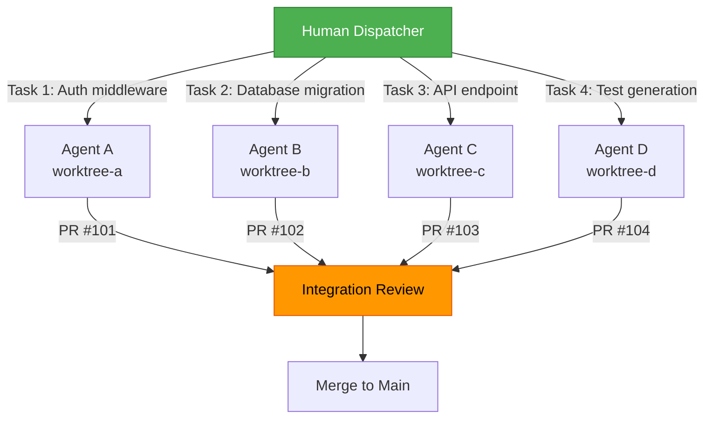
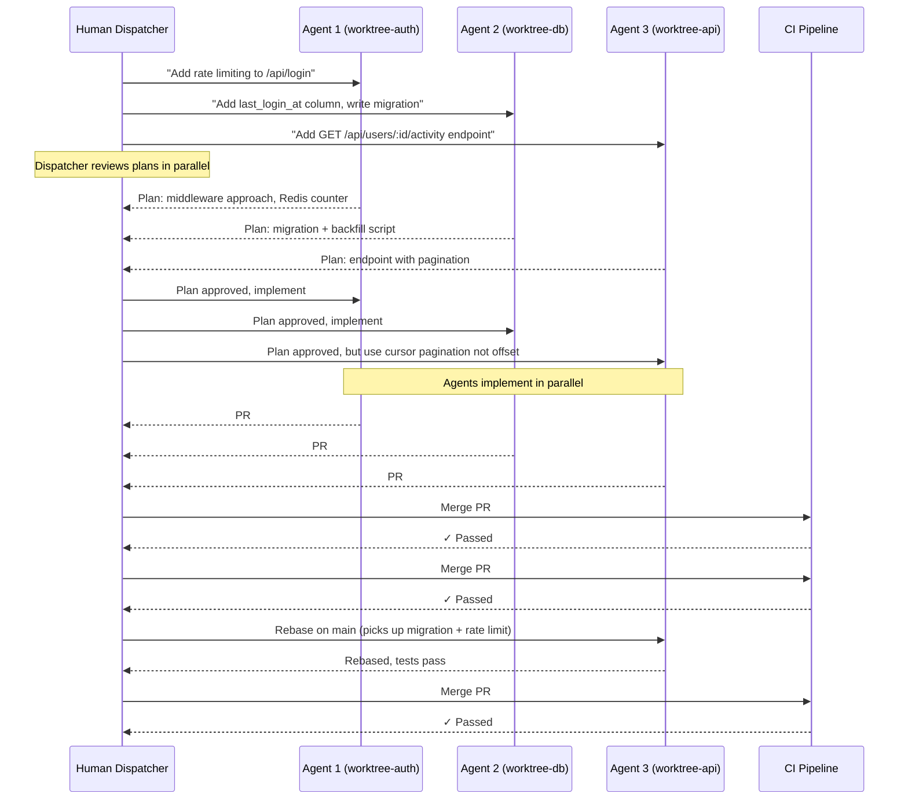
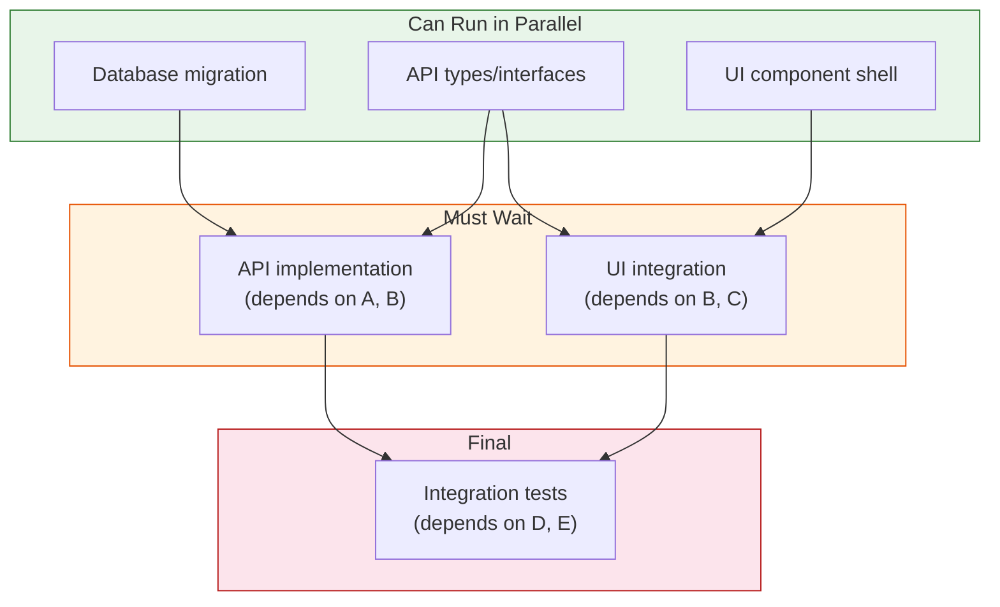
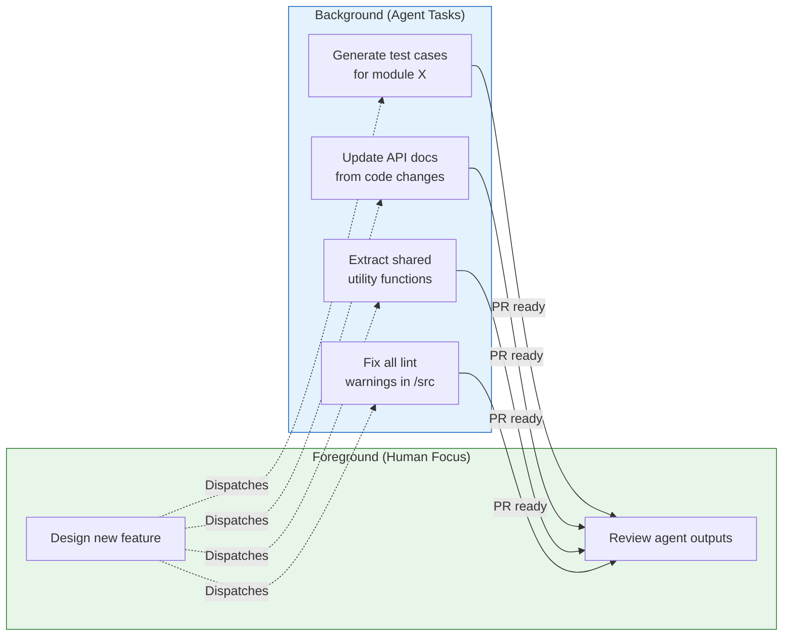
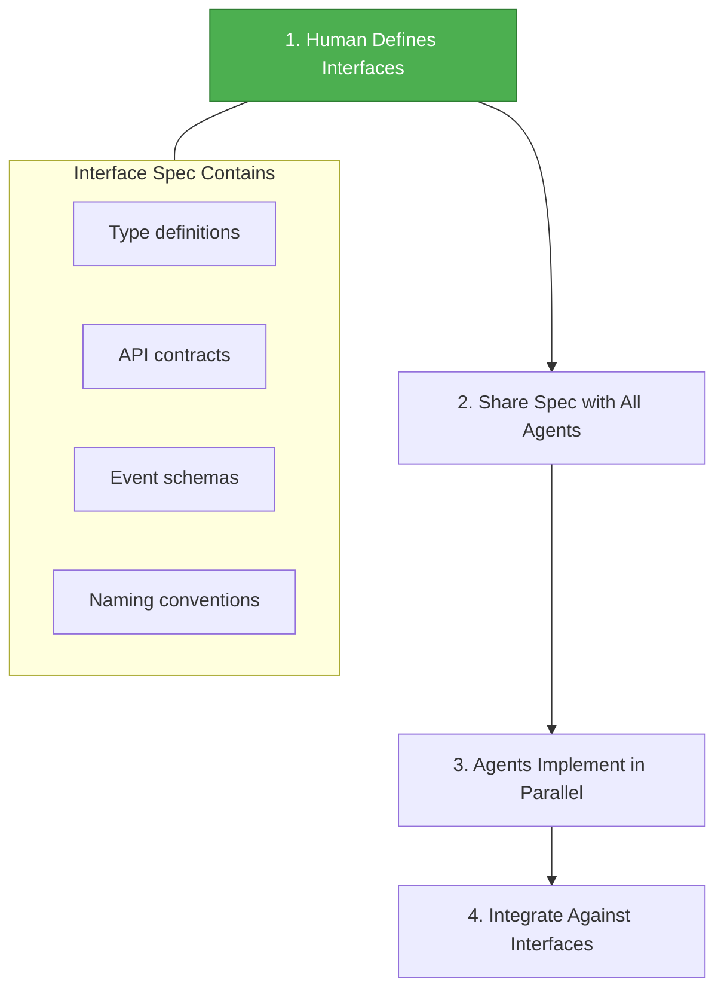
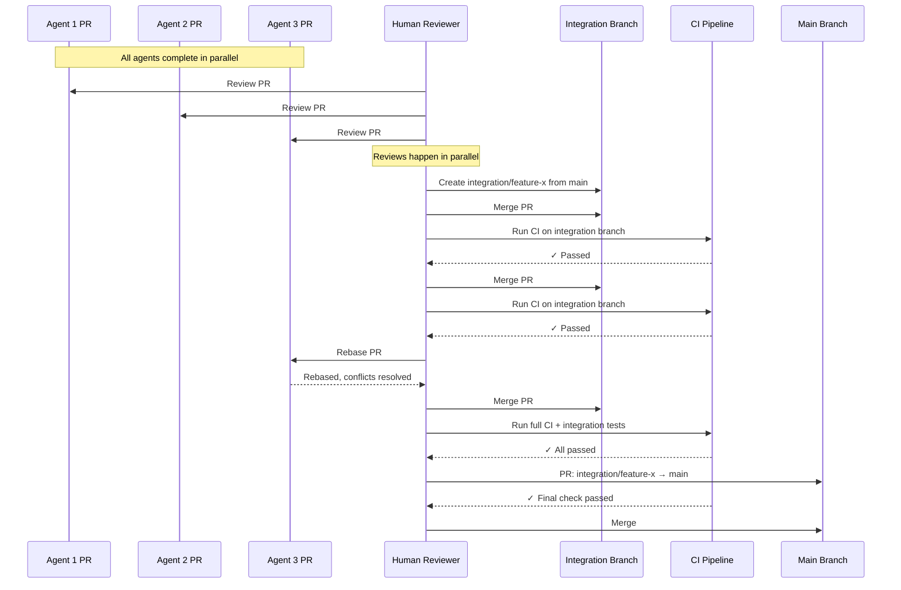
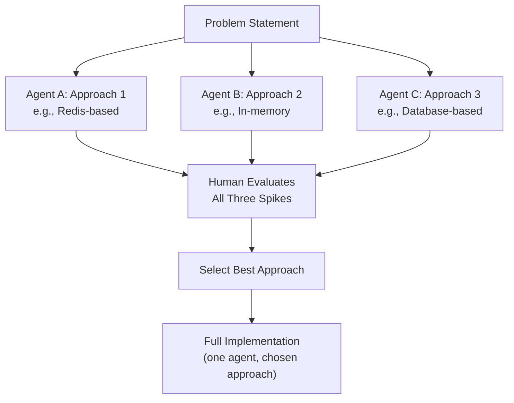
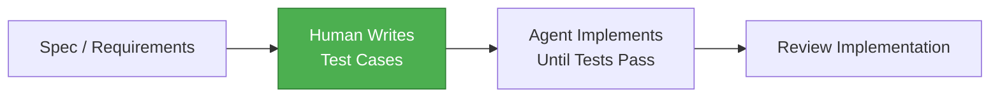
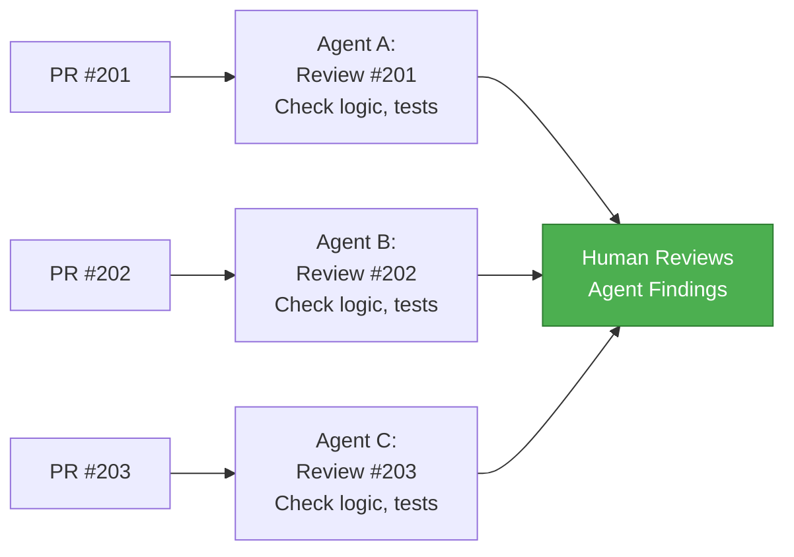
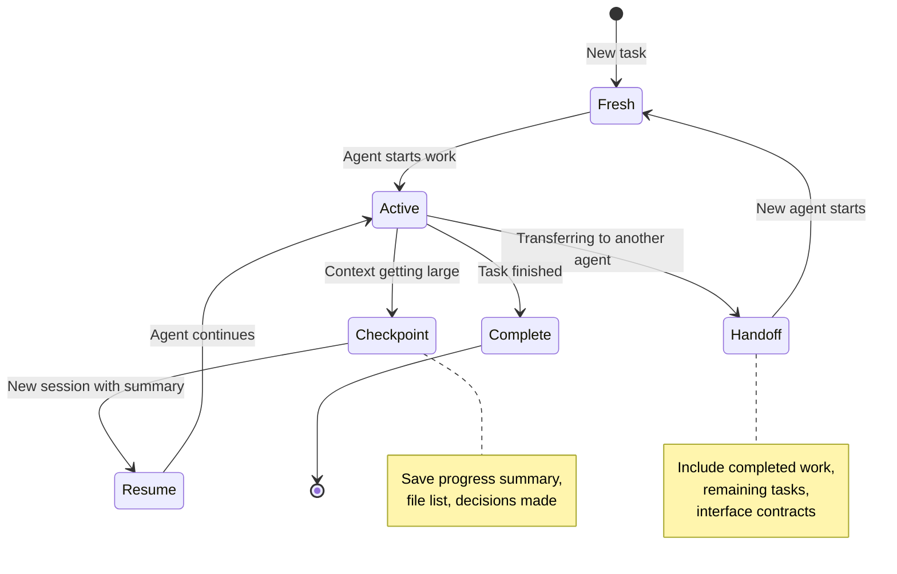

# コンパウンド開発ワークフロー

> この記事は[英語版](../../19-compound-engineering/06-compound-development-workflows.md)から翻訳されました。

## TL;DR

並列エージェント実行には**明示的な分解**、**分離**、および**統合**が必要です。これは開発自体に適用される分散システムの問題と同じです。複数のAIエージェントをワークツリーにまたがってディスパッチする一人のエンジニアは、協調問題です。ディスパッチャーパターン、Gitワークツリー分離、および構造化された統合プロトコルにより、混沌としたマルチエージェントセッションを予測可能でスケーラブルなワークフローに変換します。重要な洞察：**人間は実装者ではなくオーケストレーターです**。

---

## ディスパッチャーパターン

### 一人の人間、N個のエージェント

ディスパッチャーパターンは従来の開発モデルを逆転させます。一人のエンジニアがタスクを直列に処理する代わりに、一人のエンジニアが並列に作業する複数のエージェントを調整します。各エージェントは独自の分離されたコンテキストで作業します。



### ディスパッチャーの責務

| フェーズ | アクション | 理由 |
|---------|----------|------|
| **インテーク** | 機能リクエストまたはバグレポートを受け取る | 分割する前に全体のスコープを理解する |
| **分解** | 独立した並列化可能な単位に分割する | タスク間の依存関係を最小化する |
| **ルーティング** | 適切なコンテキストを持つエージェントに各単位を割り当てる | コンテキストが出力品質を決定する |
| **ゲート** | 実装開始前に計画をレビューする | ミスアラインメントを検出する最も安価なポイント |
| **モニタリング** | 進捗を確認し、詰まったエージェントのブロックを解除する | エージェントは曖昧さに対して静かに失敗する |
| **統合** | 出力をレビューし、コンフリクトを解決し、マージする | ディスパッチャーだけがシステム全体のコンテキストを持つ |

### 実際のセッションフロー



### アンチパターン：オーケストレーターとしてのエージェント

```
❌ Ask one agent to "build the whole feature"
   → Agent works serially (slow)
   → Agent loses context mid-way through large tasks
   → No isolation between components
   → Single point of failure

✅ Human decomposes, agents implement in parallel
   → Parallel execution (fast)
   → Each agent has focused context
   → Failures are isolated
   → Human maintains system-level coherence
```

---

## 並列処理のための作業分解

### 分解レベル

分解の粒度が、達成可能な最大並列度と調整オーバーヘッドを決定します。

| レベル | 粒度 | 最大並列度 | 調整オーバーヘッド | 最適な用途 |
|--------|------|-----------|-------------------|-----------|
| **ファイルレベル** | 各エージェントが異なるファイルで作業 | 高い | 低い | 独立したモジュール |
| **モジュールレベル** | 各エージェントがモジュール境界を所有 | 中〜高 | 中程度 | 機能開発 |
| **フィーチャーフラグ** | 各エージェントがフラグの背後でビルド | 中程度 | 低い | 段階的デリバリー |
| **レイヤーレベル** | フロントエンド / バックエンド / インフラ分割 | 中程度 | 中〜高 | フルスタック機能 |
| **フェーズレベル** | 設計 → 実装 → テスト | 低い | 低い | 直列依存関係 |

### 依存グラフが並列度を決定する



### 分解チェックリスト

並列エージェントにタスクを割り当てる前に確認してください。

```markdown
- [ ] Each task can be completed without output from another task
- [ ] Each task operates on distinct files (no overlapping edits)
- [ ] Shared interfaces are defined upfront and provided to all agents
- [ ] Each task has a clear acceptance criteria
- [ ] Merge order is determined (which PR lands first?)
- [ ] Integration points are identified (where will outputs connect?)
```

### 分解の例：ユーザーアクティビティダッシュボード

| エージェント | スコープ | ファイル | 依存関係 |
|------------|--------|--------|---------|
| A | データベースレイヤー：マイグレーション、モデル、リポジトリ | `src/db/`, `src/models/` | なし |
| B | APIレイヤー：エンドポイント、ミドルウェア | `src/handlers/`, `src/middleware/` | A（型） |
| C | フロントエンド：タイムラインコンポーネント、アクティビティフック | `src/components/`, `src/hooks/` | B（APIコントラクト） |
| D | テスト：インテグレーション、コンポーネント、E2E | `tests/` | A、B、C |

**共有コントラクト：** `ActivityEvent` インターフェースを開始前にすべてのエージェントに提供します。**マージ順序：** A、B、C、D。

### アンチパターン：循環依存

```
❌ Agent A needs Agent B's output, Agent B needs Agent A's output
   → Deadlock: neither can proceed
   → Root cause: insufficient upfront interface design

✅ Extract shared interfaces FIRST, then parallelize
   → Define types and contracts before any agent starts
   → Each agent implements against the interface, not the other agent's code
```

---

## Gitワークツリー分離

### ワークツリーを使う理由

各エージェントにはファイルコンフリクトを回避するための独自の作業ディレクトリが必要です。Gitワークツリー [1] はリポジトリを複製することなくこれを実現します。

```
# Repository structure with worktrees
project/
├── .git/                    # Shared git database
├── src/                     # Main working tree (main branch)
├── ...
└── (worktrees created outside or inside as needed)

../project-worktrees/
├── worktree-auth/           # Agent A: feature/auth-rate-limit
├── worktree-db/             # Agent B: feature/db-migration
├── worktree-api/            # Agent C: feature/api-activity
└── worktree-tests/          # Agent D: feature/activity-tests
```

### ワークツリーコマンド

```bash
# Setup: Create worktrees for parallel agents
cd /path/to/project

# Create branches from latest main
git fetch origin
git checkout main && git pull

# Create worktrees — each gets its own directory and branch
git worktree add ../project-worktrees/worktree-auth -b feature/auth-rate-limit
git worktree add ../project-worktrees/worktree-db -b feature/db-migration
git worktree add ../project-worktrees/worktree-api -b feature/api-activity
git worktree add ../project-worktrees/worktree-tests -b feature/activity-tests

# List active worktrees
git worktree list
# /path/to/project                    abc1234 [main]
# /path/to/project-worktrees/worktree-auth   def5678 [feature/auth-rate-limit]
# /path/to/project-worktrees/worktree-db     def5678 [feature/db-migration]
# /path/to/project-worktrees/worktree-api    def5678 [feature/api-activity]
# /path/to/project-worktrees/worktree-tests  def5678 [feature/activity-tests]
```

### エージェントの割り当て

```bash
# Start Agent A in the auth worktree
cd ../project-worktrees/worktree-auth
claude  # Agent A starts with focused context

# Start Agent B in the db worktree (separate terminal)
cd ../project-worktrees/worktree-db
claude  # Agent B starts with focused context

# Start Agent C in the api worktree (separate terminal)
cd ../project-worktrees/worktree-api
claude  # Agent C starts with focused context
```

### マージ戦略

| 戦略 | 使用するタイミング | コマンド |
|------|-------------------|---------|
| **逐次マージ** | タスクに依存順序がある | Aをマージ、Bをmainにリベース、Bをマージ、... |
| **統合ブランチ** | すべてのタスクがmainの前に統合される必要がある | `integration/feature-x` を作成し、すべてをそこにマージし、mainにPR |
| **フィーチャーフラグマージ** | タスクが独立で、フラグの背後にある | すべてをフラグの背後でmainに直接マージ |

#### 逐次マージ

```bash
git checkout main
git merge --no-ff feature/db-migration           # no deps, merge first
git checkout feature/api-activity && git rebase main && git checkout main
git merge --no-ff feature/api-activity            # depends on db
git merge --no-ff feature/auth-rate-limit         # independent
git checkout feature/activity-tests && git rebase main && git checkout main
git merge --no-ff feature/activity-tests          # depends on all
```

#### 統合ブランチ

```bash
git checkout -b integration/user-activity main
git merge --no-ff feature/db-migration
git merge --no-ff feature/auth-rate-limit
git merge --no-ff feature/api-activity
git merge --no-ff feature/activity-tests
npm test
gh pr create --base main --head integration/user-activity \
  --title "feat: user activity dashboard" \
  --body "Integration of parallel agent work"
```

### クリーンアップ

```bash
git worktree remove ../project-worktrees/worktree-auth
git worktree remove ../project-worktrees/worktree-db
git worktree remove ../project-worktrees/worktree-api
git worktree remove ../project-worktrees/worktree-tests
git worktree prune
git branch -d feature/auth-rate-limit feature/db-migration \
    feature/api-activity feature/activity-tests
```

### 最新の並列エージェントツール

並列エージェントワークフロー向けのツール群は急速に成熟しています。以前は手動のワークツリー管理を必要としていた分離と調整の課題に、いくつかのツールが対応するようになりました。

**Superset IDE** [2]（2026年3月リリース）：10以上の並列AIエージェントを同時に実行するために設計されたオープンソースのターミナル環境です。各エージェントは独自のスレッドとワークツリーを持ち、すべてのアクティブセッションの進捗、差分、コストを表示する統合ダッシュボードがあります。主要な革新はオーケストレーションレイヤーで、ディスパッチャーはターミナルを切り替えることなく、一つのビューですべてのエージェント出力を確認し、計画を承認/却下し、マージをトリガーできます。

**agent-worktree** [3]（GitHubツール）：AIコーディングエージェント向けにGitワークツリーのライフサイクルを自動化します。手動で `git worktree add` を実行し、ブランチを作成し、クリーンアップする代わりに、`agent-worktree` はフロー全体をラップします。`agent-worktree spawn --task "Add rate limiting" --base main` で、ワークツリー、ブランチ、エージェントセッションを一つのコマンドで作成します。エージェントのPRがマージされた後のクリーンアップとブランチ削除も処理します。

**Codex App** [4]（OpenAI）：各エージェントが独自のファイルシステム、ネットワーク名前空間、リソース制限を持つサンドボックス化されたコンテナで実行されるクラウドベースのマルチエージェント環境です。コンテナは一般的な開発ツールチェーンがプリビルドされています。エージェントが依存関係をインストールしたり、競合する可能性のあるビルドツールを実行したりする場合など、ワークツリーが提供するよりも強力な分離が必要なチームに有用です。

**核心的な洞察：** 「並列処理は難しい部分ではない。分離が難しいのだ。」 [5] — N個のエージェントを作成するのは簡単です。互いのファイル、依存関係、git状態に干渉しないことを確実にするのが本当の課題です。ワークツリーはファイル分離を解決しますが、並列作業が直列になるレビューとマージのフェーズは、どのツールも完全に自動化できていないボトルネックのままです。

**クロスツール規約としてのスキル：** 「スキル」パターン [6] — 再利用可能なエージェント能力のフォルダをプロジェクトにドロップすると、エージェントが自動検出する — は、Claude Code [7]、Cursor、VS Code（Copilot）、GitHub（Actionsエージェント）、Gooseで採用されています。この収束により、あるツール向けに書かれたスキルがますます移植可能になっています。エージェントにテストスイートの実行方法を教えるスキルは、どのエージェントプラットフォームが呼び出しても機能します。

### 分離の階層

すべての分離が同等ではありません。適切なレベルはタスクのリスクプロファイル、チームのインフラストラクチャ、コスト予算に依存します。

| レベル | メカニズム | ファイル分離 | 依存関係分離 | コスト | ユースケース |
|--------|-----------|-------------|-------------|--------|------------|
| **レベル0** | 同じディレクトリ、同じブランチ | なし | なし | 無料 | 単一エージェント、直列作業 |
| **レベル1** | 同じリポジトリ、異なるブランチ | 部分的（コミットされていない変更が競合） | なし | 無料 | 低並列度、慎重な調整 |
| **レベル2** | Gitワークツリー | 完全（別々の作業ディレクトリ） | 共有（同じnode_modulesなど） | 無料 | ほとんどのローカル並列ワークフロー |
| **レベル3** | コンテナサンドボックス（Codex App） | 完全 | 完全（各コンテナに独自の依存関係） | $0.01-0.10/セッション | CI/CDエージェント、信頼されないコード |
| **レベル4** | クラウドVM | 完全 | 完全 | $0.50-5.00/セッション | 最大分離、コンプライアンス要件 |

**レベル0** はほとんどの開発者が始める場所です。一つのエージェント、一つのディレクトリ。同じワーキングツリーで2つのエージェントを実行しようとした途端に競合が発生します。ファイルロック、部分書き込み、gitインデックスの破損が一般的です。

**レベル1** は一見機能しそうですが、あるブランチのコミットされていない変更は別のブランチの `git stash` や `git checkout` 操作から見えてしまいます。ブランチが大きく分岐すると、マージコンフリクトが発生しやすくなります。

**レベル2（ワークツリー）** はほとんどのチームにとってスイートスポットです。各エージェントは独自のチェックアウト済みブランチを持つ完全に独立した作業ディレクトリを取得しますが、すべてのワークツリーは同じ `.git` データベースを共有します。リポジトリの複製なし、作業ファイル以外のディスクコストなし、すべての場所で完全なgit履歴が利用可能です。

**レベル3と4** は依存関係とOSレベルの分離を追加します。エージェントがパッケージをインストールしたり、ビルドツールを実行したり、信頼されないコードを実行したりする場合に重要です。あるコンテナでの不正な `npm install` は別のエージェントの `node_modules` を破損できません。

**判定ヒューリスティック：** ローカル開発ワークフローにはレベル2（ワークツリー）を使用してください。CI/CDエージェントやエージェントが依存関係をインストールする場合はレベル3（コンテナ）を使用してください。コンプライアンスやセキュリティポリシーが完全な分離を要求する場合にのみレベル4（クラウドVM）を使用してください。

---

## バックグラウンドタスクパターン

### ファイアアンドレビュー

一部のタスクはバックグラウンド実行に適しています。ディスパッチャーが他の作業に集中している間にエージェントが独立して作業し、後で出力をレビューするために戻ります。



### バックグラウンドに適したタスク

| タスクの種類 | バックグラウンドで機能する理由 | レビュー工数 |
|------------|---------------------------|------------|
| 既存コードのテスト生成 | スコープが明確、既存コードが仕様 | 中程度（カバレッジを確認） |
| ドキュメント更新 | 低リスク、容易に確認可能 | 低い（正確性チェック） |
| リント/フォーマット修正 | 機械的、ツールが正確性を確認 | 低い（差分を流し読み） |
| 型アノテーション追加 | コンパイラが正確性を確認 | 低い（型チェックがパス） |
| 依存関係更新 | CIが互換性を確認 | 中程度（変更履歴レビュー） |
| コードマイグレーション（構文アップグレード） | パターンベース、テスト可能 | 中程度（動作を確認） |

### バックグラウンドに不向きなタスク

| タスクの種類 | 失敗する理由 |
|------------|------------|
| 新機能の実装 | 反復的なフィードバックが必要 — エージェントが誤った方向に進む |
| アーキテクチャの決定 | 人間の判断が必要 — エージェントは「適切」よりも「人気」を選ぶ |
| セキュリティ上重要な変更 | 設計段階で専門家のレビューが必要 |
| クロスモジュールリファクタリング | システム全体の理解が必要 |

### バックグラウンドタスクテンプレート

```markdown
## Background Task: [Title]
### Scope: [Exact files/directories]
### Instructions: [Step-by-step]
### Constraints: Do NOT modify files outside scope. No new dependencies.
### Acceptance: All existing tests pass + [task-specific criteria]
### When Done: Create PR with label "background-task"
```

---

## 並列エージェント協調

### 共有状態のハザード

複数のエージェントが並列で作業する場合、共有状態は並行プログラミングと同じハザードを生み出します。

| ハザード | 例 | 軽減策 |
|---------|-----|--------|
| **書き込み競合** | 2つのエージェントが同じファイルを変更 | エージェントごとのファイルレベル所有権 |
| **スキーマ競合** | 2つのエージェントが同じシーケンス番号のマイグレーションを追加 | マイグレーション番号を事前に割り当てる |
| **インポート競合** | 2つのエージェントがindex.tsに異なるエクスポートを追加 | 統合ブランチ経由でマージ |
| **規約のドリフト** | エージェントが異なる命名規約を採用 | コンテキストにスタイルガイドを提供 |
| **依存関係の競合** | エージェントAがlodashを追加、エージェントBがramdaを追加 | 依存関係を事前承認 |
| **型の競合** | 2つのエージェントが重複する型を定義 | 共有型を事前に定義 |

### コンフリクト検出

```bash
# Check all pairs of parallel branches for conflicts before integration
BRANCHES=(feature/auth feature/db feature/api feature/tests)
for i in "${BRANCHES[@]}"; do
    for j in "${BRANCHES[@]}"; do
        if [ "$i" != "$j" ]; then
            git checkout "$i" 2>/dev/null
            if ! git merge --no-commit --no-ff "$j" 2>/dev/null; then
                echo "CONFLICT: $i ↔ $j"
            fi
            git merge --abort 2>/dev/null
        fi
    done
done
```

### 仕様ファースト協調パターン

最も効果的な協調戦略は、エージェントが実装を開始する前にすべてのインターフェースを定義することです。



### 共有インターフェースの例

```typescript
// shared-types.ts — created by human BEFORE agents start, read-only for all agents
export interface ActivityEvent {
  id: string;
  userId: string;
  type: 'login' | 'logout' | 'create' | 'update' | 'delete';
  resource: string;
  timestamp: Date;
  metadata: Record<string, unknown>;
}

export interface PaginatedResponse<T> {
  items: T[];
  cursor: string | null;
  hasMore: boolean;
}

export enum ErrorCode {
  NOT_FOUND = 'NOT_FOUND',
  INVALID_INPUT = 'INVALID_INPUT',
  UNAUTHORIZED = 'UNAUTHORIZED',
  RATE_LIMITED = 'RATE_LIMITED',
}
```

---

## 統合プロトコル

### 段階的レビューとマージ



### 統合チェックリスト

```markdown
## Pre-Integration
- [ ] All individual PRs reviewed and approved
- [ ] No dependency conflicts between branches
- [ ] Shared types/interfaces match across all branches
- [ ] Migration sequence numbers don't conflict

## During Integration
- [ ] Merge in dependency order (db → api → frontend → tests)
- [ ] Run CI after each merge
- [ ] Resolve conflicts with full context (not just git's suggestion)

## Post-Integration
- [ ] Full test suite passes
- [ ] Integration/E2E tests pass
- [ ] No regressions in existing functionality
- [ ] Performance benchmarks within acceptable range
```

### コンフリクト解決判定テーブル

| コンフリクトの種類 | 解決戦略 | 解決者 |
|-------------------|---------|--------|
| インポート順序 | いずれかを受け入れ、フォーマッターを実行 | 自動 |
| パッケージロックファイル | ゼロから再生成 | 自動 |
| 同じファイル、異なるセクション | 手動マージ | 人間 |
| 同じ関数、異なるロジック | 仕様に基づいて選択 | 人間 |
| 型定義の不一致 | 共有仕様に合わせる | 人間 |
| テストファイルの重複 | テストスイートを統合 | 人間またはエージェント |
| 設定の重複 | 設定をマージし、テスト | 人間 |

---

## ワークフローパターンカタログ

### パターン1：スパイクアンドコンバージ

**用途：** アプローチが不確定で、選択肢を探索する必要がある場合。



**時間コスト：** スパイクフェーズでエージェント計算量は3倍ですが、誤った方向への実装で数日を無駄にすることを防ぎます。

**スパイク評価の判定基準：**

| 基準 | 重み | 評価方法 |
|------|------|---------|
| 正確性 | 30% | すべてのエッジケースに対応しているか？ |
| シンプルさ | 25% | コード行数、依存関係数 |
| パフォーマンス | 20% | ベンチマーク結果 |
| 保守性 | 15% | 可読性、テストカバレッジ |
| 運用コスト | 10% | インフラストラクチャ要件 |

### パターン2：テストファースト委任

**用途：** 動作が十分に仕様化されており、信頼性の高い実装が必要な場合。



**機能する理由：** 人間が書いたテストが仕様をエンコードします。エージェントの仕事はテストをパスさせることに限定されます。これは明確で検証可能な目標です。これにより共生成問題を完全に排除できます。

```bash
# Human writes tests first
# tests/auth/rate-limit.test.ts

# Then dispatches to agent with clear instruction:
# "Implement src/middleware/rate-limit.ts to make all tests in
#  tests/auth/rate-limit.test.ts pass. Do not modify the test file."
```

### パターン3：リファクタリングパイプライン

**用途：** 多数のファイルにまたがる大規模リファクタリング。

```
PHASE 1: Analysis (1 agent)
  → Identify all usage sites
  → Generate dependency graph
  → Propose refactor plan

PHASE 2: Execution (N agents, parallel)
  → Agent A: Refactor module X
  → Agent B: Refactor module Y
  → Agent C: Refactor module Z
  → Each agent has the shared interface contract

PHASE 3: Verification (1 agent)
  → Run full test suite
  → Check for orphaned imports
  → Verify no behavior changes
```

### パターン4：ドキュメントスイープ

**用途：** ドキュメントがコードから乖離しており、一括更新が必要な場合。

```
ASSIGNMENT: One agent per documentation area
  → Agent A: API reference docs (reads routes, generates OpenAPI)
  → Agent B: Architecture docs (reads code, updates diagrams)
  → Agent C: README and quickstart (reads setup, verifies steps)
  → Agent D: Inline code comments (reads complex functions, adds JSDoc)

CONSTRAINT: Agents read code, write docs. Never modify source code.
```

### パターン5：並列レビュー

**用途：** 複数のPRがキューに溜まっており、レビューのスループットを上げたい場合。



**エージェントレビュープロンプト：** ロジックエラー（エッジケース、エラーハンドリング）、セキュリティの問題、テストカバレッジのギャップ、APIコントラクト違反、パフォーマンスの懸念を確認します。出力はBLOCKING / WARNING / NOTEの形式で行います。

### パターン6：セキュリティ並行

**用途：** セキュリティ境界に関わる機能を実装する場合。

```
PARALLEL EXECUTION:
  Agent A: Implement the feature (functional)
  Agent B: Write security test cases (adversarial)
  Agent C: Run threat model analysis (analytical)

INTEGRATION:
  1. Agent B's security tests must pass against Agent A's implementation
  2. Agent C's threat model findings must be addressed
  3. Human reviews the combined output with security focus
```

### パターンサマリー

| パターン | 並列度 | リスクレベル | 最適な用途 |
|---------|--------|------------|-----------|
| スパイクアンドコンバージ | 探索 | 低い（使い捨て） | アーキテクチャの決定 |
| テストファースト委任 | 低い（直列） | 低い（テストがオラクル） | 十分に仕様化された機能 |
| リファクタリングパイプライン | 高い（実行フェーズ） | 中程度 | 大規模な変更 |
| ドキュメントスイープ | 高い | 低い | 一括ドキュメント更新 |
| 並列レビュー | 高い | 低い | PRキューのバックログ |
| セキュリティ並行 | 中程度 | 中〜高 | セキュリティ上重要な機能 |

---

## コスト管理

### エンジニアリング上の関心事としてのAPI支出

AIエージェントの使用には直接的なコスト要素があります [8]。人間のエンジニア（固定給与）とは異なり、エージェントのコストは使用量に応じてスケールし、クラウドインフラストラクチャと同様に予算化する必要があります。

### タスクタイプ別のトークン予算

| タスクの種類 | 推定トークン数 | 推奨モデル | コスト見積もり |
|------------|--------------|-----------|-------------|
| 計画生成 | 2K-5K出力 | Sonnet | $0.02-0.05 |
| コード実装（小規模） | 5K-15K出力 | Sonnet | $0.05-0.15 |
| コード実装（大規模） | 15K-50K出力 | Sonnet | $0.15-0.50 |
| コードレビュー | 3K-10K出力 | Sonnet | $0.03-0.10 |
| テスト生成 | 10K-30K出力 | Sonnet | $0.10-0.30 |
| アーキテクチャスパイク | 5K-20K出力 | Opus | $0.30-1.20 |
| 複雑なデバッグ | 10K-40K出力 | Opus | $0.60-2.40 |
| ドキュメント | 5K-15K出力 | Sonnet | $0.05-0.15 |
| リント/フォーマット修正 | 2K-8K出力 | Haiku | $0.002-0.008 |
| 型アノテーション | 3K-10K出力 | Haiku | $0.003-0.010 |

### モデル選択ルール

| シグナル | モデル | 根拠 |
|---------|-------|------|
| アーキテクチャ推論、複雑なデバッグ、セキュリティレビュー | Opus | 深い判断が必要 |
| 機能実装、コードレビュー、テスト生成 | Sonnet | ほとんどの作業のデフォルト |
| フォーマット、リンティング、型アノテーション、単純なリファクタリング | Haiku | 機械的、低判断 |

### コスト追跡

タスクごとのトークン使用量を追記専用ログ（例：`.claude/cost-log.jsonl`）で追跡します。週次で集計して、高コストのタスクカテゴリやモデルのミスマッチを特定します。

### アンチパターン：すべてにOpusを使用

```
❌ Use Opus for all tasks
   → $50/day for work that could cost $5/day
   → No quality improvement for mechanical tasks
   → Budget exhausted before sprint ends

✅ Match model to task complexity
   → Opus for architecture and debugging ($2-5/task)
   → Sonnet for implementation ($0.10-0.50/task)
   → Haiku for mechanical work ($0.01/task)
   → 10× cost reduction with equivalent quality
```

---

## セッション管理

### コンテキストウィンドウの問題

エージェントセッションには有限のコンテキストウィンドウがあります。長いセッションはコンテキストが陳腐化した情報で埋まるにつれて品質が低下します。効果的なセッション管理はコンテキスト境界をまたいで継続性を維持します。

### 再開パターン

| パターン | 使用するタイミング | 含めるもの |
|---------|-------------------|-----------|
| **チェックポイントサマリー** | タスク途中の一時停止 | 完了項目、進行中の項目、次のステップ、主要な決定、変更されたファイル |
| **コンテキスト要約** | 新しいセッションの再開 | プロジェクトコンテキスト、既存のもの、必要な作業、規約 |
| **引き継ぎプロンプト** | エージェント間の転送 | 前のエージェントの出力、残りのタスク、インターフェースコントラクト、制約 |

#### チェックポイントサマリーテンプレート

```markdown
## Session Checkpoint — 2026-03-15 14:30

### Completed
- [x] Created database migration for activity_events table
- [x] Implemented ActivityEvent model with types

### In Progress
- [ ] API endpoint (handler skeleton exists)

### Next Steps
1. Complete request validation in handler
2. Add cursor-based pagination

### Key Decisions
- Cursor pagination (not offset) — reviewer feedback
- Timestamp-based cursor using created_at
```

#### 引き継ぎプロンプトテンプレート

```markdown
## Handoff: Agent A → Agent B

### Agent A's Output
- PR #102 (merged): Database migration + model + repository

### Agent B's Task
Implement GET /api/users/:id/activity endpoint.

### Constraints
- Do NOT modify any files Agent A created
- Follow existing handler patterns in src/handlers/
- Use cursor-based pagination
```

### セッションライフサイクル



### アンチパターン：無限セッション

```
❌ Keep one agent session running for hours
   → Context window fills with irrelevant history
   → Agent starts contradicting its earlier decisions
   → Quality degrades progressively
   → Errors compound (agent forgets constraints)

✅ Checkpoint every 30-45 minutes of active work
   → Fresh context for each phase
   → Summary preserves decisions without noise
   → Consistent quality throughout the task
   → Clear audit trail of progress
```

---

## 実世界の例

### エンドツーエンド：コードベースのMermaidダイアグラム変換

**シナリオ：** ドキュメントリポジトリの4つのディレクトリにまたがる47個のASCIIダイアグラムをMermaidに変換する必要があります。各ダイアグラムは独立しており、並列エージェントに最適です。

```bash
# Step 1: Decompose (Human, 10 min)
grep -rl "┌\|├\|└\|│\|───" docs/ | wc -l  # 47 files
# Group A: docs/architecture/ (12), Group B: docs/api/ (10)
# Group C: docs/guides/ (13),      Group D: docs/reference/ (12)

# Step 2: Create worktrees (Human, 2 min)
git fetch origin && git checkout main && git pull
git worktree add ../wt/arch -b refactor/mermaid-architecture
git worktree add ../wt/api -b refactor/mermaid-api
git worktree add ../wt/guides -b refactor/mermaid-guides
git worktree add ../wt/ref -b refactor/mermaid-reference

# Step 3: Dispatch agents — one per worktree (Human, 5 min)
# Each agent gets: file list, conversion instructions, constraints

# Step 4: Integrate (Human, 20 min)
git checkout -b refactor/mermaid-all main
git merge --no-ff refactor/mermaid-architecture
git merge --no-ff refactor/mermaid-api
git merge --no-ff refactor/mermaid-guides
git merge --no-ff refactor/mermaid-reference
npm run docs:build  # verify rendering

# Step 5: Cleanup
git worktree remove ../wt/arch ../wt/api ../wt/guides ../wt/ref
git worktree prune
```

### 結果

| メトリクス | 直列（1エージェント） | 並列（4エージェント） |
|-----------|---------------------|---------------------|
| 実時間 | 約2時間 | 約35分 |
| 人間の時間 | 約30分（レビュー） | 約40分（ディスパッチ＋レビュー） |
| エージェント計算コスト | 約$2.00 | 約$2.00（総作業量は同じ） |
| マージコンフリクト | 0 | 0（ファイルレベル分離） |
| 変換エラー | 約3 | 約3（同じエラー率） |

**重要な洞察：** 並列実行は、わずかに多い人間の調整時間で、実時間を約70%削減します。総計算コストは同じです。タスクが独立している場合、並列処理は無料です。

---

## 重要なポイント

1. **人間は実装者ではなくオーケストレーター。** ディスパッチャーパターンは開発モデルを逆転させます。一人の人間がN個のエージェントを調整します。人間の仕事は分解、ルーティング、ゲート、統合という最もレバレッジの高い活動です。

2. **分解の品質が並列度を決定する。** 独立したタスクは完全に並列実行できます。依存するタスクは順序付ける必要があります。クリーンな分解への投資は、実行速度で配当を生みます。

3. **Gitワークツリーは無料の分離を提供する。** 各エージェントはリポジトリを複製することなく、独自の作業ディレクトリとブランチを取得します。これにより並列実行中のファイルレベルの競合が排除されます。

4. **エージェントをディスパッチする前にインターフェースを定義する。** 仕様ファースト協調パターン — エージェントが開始する前に共有型とコントラクトを定義する — は、最も一般的な統合失敗を防ぎます。

5. **モデルをタスクに合わせる。** アーキテクチャと複雑な推論にはOpus、実装にはSonnet、機械的な作業にはHaikuを使用します。品質を落とさず最大10倍のコスト削減が可能です。

6. **セッション管理は第一級の関心事。** チェックポイントサマリー、コンテキスト圧縮、引き継ぎプロンプトにより、コンテキストウィンドウの境界をまたいで品質を維持します。無限セッションを避けてください。

7. **バックグラウンドタスクはファイアアンドレビュー。** テスト生成、ドキュメント更新、リント修正、型アノテーションは優れたバックグラウンドタスクです。新機能やアーキテクチャの決定はそうではありません。

8. **統合は並列作業が直列になる場所。** 統合ブランチを使用し、依存順序でマージし、各マージ後にCIを実行してください。統合プロトコルがクリティカルパスです。

9. **コスト管理はエンジニアリング管理。** タスクタイプごとのトークン使用量を追跡してください。エージェントの支出をクラウドインフラストラクチャと同様に予算化してください。最も安いトークンは送信しないトークンです。

10. **並列実行の時間短縮は実際に効果がある。** 独立したタスクは並列エージェントにより準線形のスピードアップを達成します。総計算コストは変わりません。同じトークンを支払い、ただ速くなるだけです。

---

## References

1. [Git — git-worktree Documentation](https://git-scm.com/docs/git-worktree)
2. [Superset IDE — Open-Source Parallel Agent Terminal](https://supersetide.com/)
3. [agent-worktree — Git Worktree Automation for AI Agents](https://github.com/nichochar/agent-worktree)
4. [OpenAI — Codex](https://openai.com/index/introducing-codex/)
5. [Nx Blog — Using Git Worktrees for Parallel Agent Development](https://nx.dev/blog/using-git-worktrees-for-parallel-agent-development)
6. [Anthropic — Claude Code Custom Slash Commands](https://docs.anthropic.com/en/docs/claude-code/slash-commands)
7. [Anthropic — Claude Code Overview](https://docs.anthropic.com/en/docs/claude-code/overview)
8. [Anthropic — API Pricing](https://www.anthropic.com/pricing)
