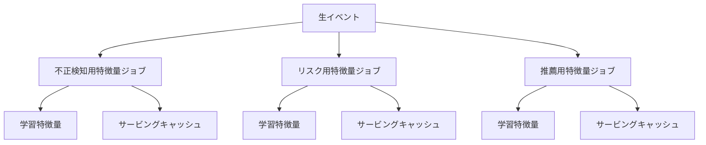
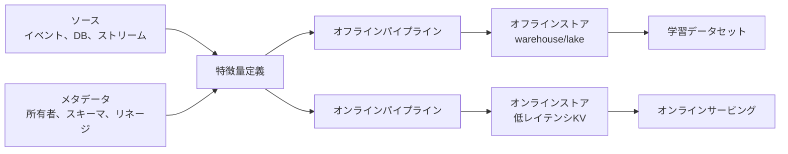
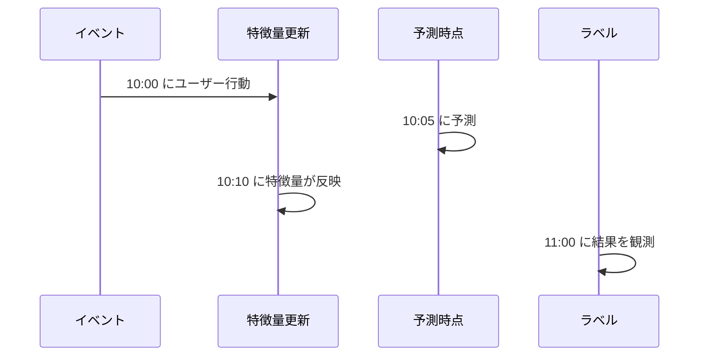

# フィーチャーストア

## TL;DR

フィーチャーストアは、オフライン学習とオンラインサービングで再利用される特徴量を管理します。単なる保存場所ではなく、一貫性を守るシステムです。重要なのは、時点整合性、鮮度、スキーマとバージョン、発見可能性、所有者、学習・サービング間のパリティです。

---

## 解決する問題

フィーチャーストアがないと、各モデルチームが独自の特徴量パイプラインを作ります。



同じ「直近7日の購入回数」がチームごとに違う意味になり、再利用性と信頼性が落ちます。

---

## アーキテクチャ



保存エンジンは違ってもかまいません。意味論は一致させる必要があります。

---

## オフラインとオンライン

| ストア | 最適化対象 | 主なリスク |
|---|---|---|
| オフラインストア | 履歴JOIN、スキャン、バックフィル | 時点整合性のバグ |
| オンラインストア | 低レイテンシ参照 | 古い特徴量、ホットキー |
| メタデータストア | 発見、所有者、リネージ | 所有者不明の特徴量 |

---

## 時点整合性

学習では、予測時点で利用可能だった特徴量だけを使う必要があります。



10:05の予測では、10:10に反映された値は利用できません。これを学習に使うと未来情報のリークになります。

必要な時刻:

- イベント時刻: 事実が起きた時刻。
- 取り込み時刻: システムが受け取った時刻。
- 利用可能時刻: サービングで使えるようになった時刻。
- エンティティキー: user、account、item、device、sessionなど。

---

## 特徴量契約

特徴量契約には次を含めます。

- 名前と説明。
- エンティティキー。
- 値の型と範囲。
- 所有者。
- 鮮度SLO。
- オフラインソースとオンラインソース。
- バックフィル動作。
- NULL/default動作。
- 廃止計画。

```yaml
name: user_failed_login_count_10m
entity: user_id
type: int64
freshness_slo: 120s
default: 0
owner: identity-risk
offline_source: warehouse.login_events
online_source: redis:user-risk
availability_timestamp: materialized_at
```

---

## 障害モード

### 学習・サービング間のズレ

オフラインSQLとオンライン変換が少しずつ違っていく問題です。

対策: 1つの特徴量定義から両方を生成するか、オンラインリクエストをオフラインパイプラインで再計算して比較します。

### 古いオンライン特徴量

オンラインストアは動いているが更新が止まっている状態です。

対策: 特徴量グループごとの最新更新時刻を監視し、鮮度予算を超えたらフォールバックします。

### ホットエンティティ

人気ユーザー、人気商品、大規模加盟店などがオンラインストアのホットキーになります。

対策: ローカルキャッシュ、時間窓でのキー分割、集約特徴量の事前計算を使います。

---

## 運用メトリクス

| メトリクス | 目的 |
|---|---|
| 特徴量鮮度ラグ | 反映停止を検出 |
| オンライン参照レイテンシ | 予測p99に影響 |
| 参照ミス率 | キー設計やバックフィル漏れを検出 |
| NULL/default率 | ソース回帰を検出 |
| オフライン/オンライン差分 | ズレを検出 |
| 特徴量利用数 | 削除と所有者管理に使う |

---

## 重要なポイント

1. フィーチャーストアは一貫性システムである。
2. 時点整合性は未来情報リークを防ぐ。
3. 特徴量鮮度はSLOとして監視する。
4. 保存先は違っても意味論は一致させる。
5. 特徴量の所有者と廃止計画は信頼性の一部。

---

## 参考文献

1. [Feast Documentation](https://docs.feast.dev/)
2. [Data Validation for Machine Learning](https://mlsys.org/Conferences/2019/doc/2019/167.pdf)
3. [Hidden Technical Debt in Machine Learning Systems](https://proceedings.neurips.cc/paper_files/paper/2015/file/86df7dcfd896fcaf2674f757a2463eba-Paper.pdf)
4. [Uber Michelangelo: Machine Learning Platform](https://www.uber.com/blog/michelangelo-machine-learning-platform/)
