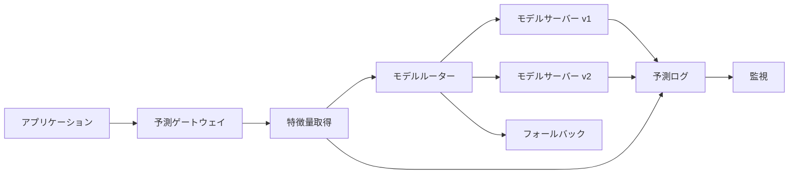
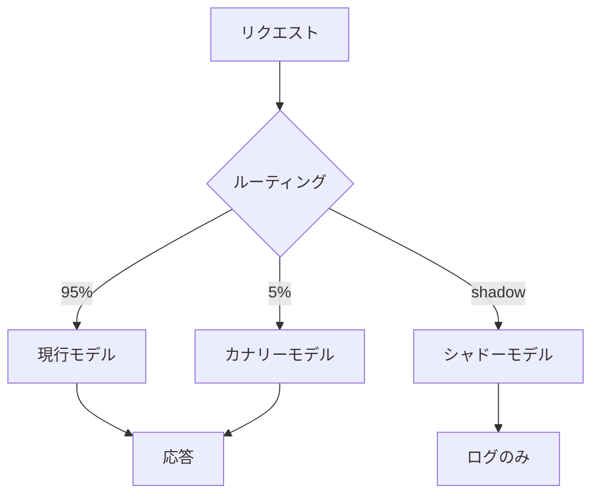

# モデルサービング

## TL;DR

モデルサービングは、学習済み成果物を本番予測に変換します。設計は、レイテンシ、スループット、モデルサイズ、ハードウェア、特徴量鮮度、ロールアウト安全性、観測性に左右されます。良いサービング基盤は、モデル版のロード、トラフィックルーティング、バッチング、タイムアウト、障害説明、アプリケーションコードから独立したロールバックを扱えます。

---

## サービングモード

| モード | レイテンシ | 用途 |
|---|---:|---|
| バッチスコアリング | 分から時間 | 日次推薦、チャーンスコア |
| オンライン同期 | ミリ秒から秒 | 不正検知、ランキング、パーソナライズ |
| オンライン非同期 | 秒から分 | エンリッチメント、レビューキュー |
| ストリーミング推論 | イベントごとに低遅延 | 異常検知、不正検知 |
| エッジ推論 | ローカル | オフラインアプリ、プライバシー重視 |

---

## オンラインサービング構成



予測ログは必須です。リクエスト、モデルバージョン、特徴量、予測、レイテンシ、後から結合されるラベルを残します。

---

## レイテンシ予算

```text
合計p99予算: 100 ms

ネットワーク入力     10 ms
認証/ルーティング     5 ms
特徴量参照           25 ms
モデル推論           40 ms
後処理               10 ms
ログ/応答            10 ms
```

特徴量参照が予算を使い切るなら、モデルだけを高速化してもユーザー体験は改善しません。

---

## モデルバージョンとルーティング



代表的な方針:

- Champion/challenger: 現行モデルと候補モデルを比較する。
- Canary: 少量のライブトラフィックで候補を検証する。
- Shadow: 応答には使わず候補を実行する。
- Segment routing: 地域、テナント、端末、リスク層で分ける。
- Fallback: 主要経路が失敗したら単純モデルやルールに戻す。

---

## バッチング

| 戦略 | 長所 | リスク |
|---|---|---|
| バッチなし | 予測可能なレイテンシ | ハードウェア利用率が低い |
| 固定バッチ | 容量計画が簡単 | バッチ充填待ちが発生 |
| 動的バッチ | 利用率が高い | p99挙動が複雑 |
| 継続バッチ | 大型モデルで効率的 | スケジューラが複雑 |

計算が重く、少し待てるリクエストでは有効です。厳しいp99予算がある場合は慎重に使います。

---

## 障害モード

### モデルロード失敗

成果物が壊れている、ランタイム非互換、依存関係不足、テンソル形状不一致などでロードできません。

対策: 昇格前に成果物を検証し、新モデルがヘルスチェックに通るまで旧モデルを維持します。

### 特徴量取得タイムアウト

モデルサーバーは正常でも、特徴量取得が失敗します。

対策: 厳しいタイムアウト、フォールバック特徴量、安全なキャッシュ、特徴量ストア単独の可用性監視を用意します。

### テールレイテンシ崩壊

平均は正常でも、バースト時にキューが伸びてp99が悪化します。

対策: キュー上限、ロードシェディング、入場制御、高コストモデル用の別プールを使います。

---

## 運用メトリクス

| レイヤー | メトリクス |
|---|---|
| リクエスト | QPS、p50/p95/p99、タイムアウト率、エラー率 |
| キュー | 深さ、待ち時間、破棄数 |
| モデル | 推論時間、ロード時間、バージョン、メモリ |
| ハードウェア | CPU/GPU使用率、GPUメモリ、アクセラレータエラー |
| 特徴量 | 参照レイテンシ、鮮度、ミス率 |
| 品質 | ガードレール、遅延ラベル、ドリフト、キャリブレーション |

---

## 重要なポイント

1. モデルサービングはモデル固有の障害モードを持つ本番サービスである。
2. モデル成果物はアプリケーションコードから独立してロールアウトする。
3. 予測ログは監視、デバッグ、再学習に必須。
4. バッチングはスループットを改善するがp99と交換になる。
5. フォールバック動作はデプロイ前に設計する。

---

## 参考文献

1. [TensorFlow Serving: Flexible, High-Performance ML Serving](https://arxiv.org/abs/1712.06139)
2. [KServe Documentation](https://kserve.github.io/website/)
3. [MLflow Model Registry](https://mlflow.org/docs/latest/ml/model-registry/)
4. [Hidden Technical Debt in Machine Learning Systems](https://proceedings.neurips.cc/paper_files/paper/2015/file/86df7dcfd896fcaf2674f757a2463eba-Paper.pdf)
