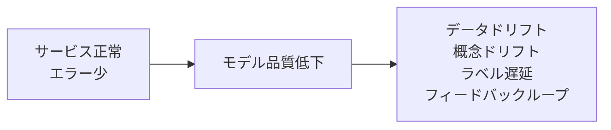
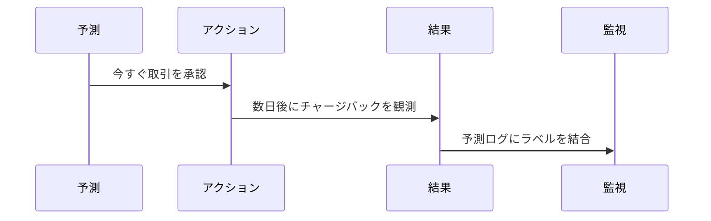

# モデル監視

## TL;DR

モデル監視は、予測サービスが稼働しているかだけでなく、モデルがまだ有用かを検出します。データ品質、特徴量と予測のドリフト、モデル品質、ビジネス影響の4層を監視します。難しい点はラベル遅延です。真の結果は予測から数時間、数日、数か月後に届くことがあります。

---

## サービス監視だけでは足りない

HTTP 200は悪い予測を隠します。モデルは高速に応答しながら、コンバージョンを下げたり、不正を見逃したり、低品質なコンテンツを上位に出したりします。

---

## 監視レイヤー

| レイヤー | 問い | 例 |
|---|---|---|
| データ品質 | 入力は妥当か | NULL率、スキーマ変更、範囲チェック |
| 特徴量鮮度 | 入力は新しいか | 最終更新時刻、参照ミス率 |
| ドリフト | 本番は学習時と違うか | 分布距離、カテゴリ比率 |
| 予測挙動 | 出力が変化しているか | スコア分布、信頼度、クラス比率 |
| 品質 | 正しいか | Precision、Recall、キャリブレーション |
| ビジネス影響 | システム成果は健全か | 売上、不正損失、継続率、苦情 |

---

## ドリフトの種類

### データドリフト

入力分布が変わります。例: ある地域で学習したローンモデルに別地域のトラフィックが流れる。

### 概念ドリフト

入力とラベルの関係が変わります。例: 攻撃者が現在の不正検知モデルに適応する。

### 予測ドリフト

モデル出力の分布が変わります。例: 推薦モデルが狭い商品カテゴリに極端に高いスコアを出し始める。

### ラベルドリフト

ターゲット分布が変わります。例: 攻撃キャンペーンでスパムの基本率が変化する。

---

## ラベル遅延

クリックのようにすぐラベルが得られるものもあれば、不正チャージバックやローンデフォルトのように時間がかかるものもあります。高速な代理指標と遅い真の指標を分けて扱います。

---

## 予測ログ

予測ログには以下を含めます。

- リクエストIDと時刻。
- エンティティID。
- モデル名とバージョン。
- 特徴量または特徴量参照。
- 予測と信頼度。
- ルーティング経路: champion、canary、shadow、fallback。
- レイテンシとエラー情報。
- 実験割り当て。
- 後から結合されるラベルと結果時刻。

機密データを直接ログに残さず、参照、ハッシュID、承認済み特徴量を使います。

---

## アラート方針

| アラート | ページするか | 対応 |
|---|---|---|
| サービングエラー率が高い | はい | 可用性を復旧 |
| 重要モデルの特徴量鮮度SLO違反 | はい | フェイルオーバーまたは無効化 |
| 予測分布が急変 | 通常はいいえ | 営業時間内に調査 |
| 遅延品質指標がガードレール未満 | 場合による | ロールバックまたはトラフィック削減 |
| カナリーのビジネスKPI悪化 | 重要フローでははい | ロールアウト停止 |

---

## 障害モード

### 代理指標の罠

代理指標は改善しているのに、実際のユーザー成果やビジネス成果が悪化します。

対策: ガードレール、実験、複数指標での昇格判断を使います。

### 隠れたスライス劣化

全体品質は安定しているが、一部セグメントだけ悪化します。

対策: 地域、端末、言語、テナント、リスク層、新規ユーザーなど重要スライスを監視します。

### 本番データではなく学習データを監視している

ダッシュボードが本番リクエスト分布ではなく、きれいなオフライン検証データを見ています。

対策: 本番予測ログを監視し、学習ベースラインと比較します。

---

## 重要なポイント

1. 正常に動くサービスでも悪い予測を返すことがある。
2. 本番入力と予測分布を監視する。
3. ラベル遅延は品質測定速度を決める。
4. スライス監視は集計値に隠れた劣化を見つける。
5. 監視はロールバック、再学習、調査につながる必要がある。

---

## 参考文献

1. [Hidden Technical Debt in Machine Learning Systems](https://proceedings.neurips.cc/paper_files/paper/2015/file/86df7dcfd896fcaf2674f757a2463eba-Paper.pdf)
2. [Data Validation for Machine Learning](https://mlsys.org/Conferences/2019/doc/2019/167.pdf)
3. [TFX: A TensorFlow-Based Production-Scale Machine Learning Platform](https://dl.acm.org/doi/10.1145/3097983.3098021)
4. [Evidently Documentation](https://docs.evidentlyai.com/)
